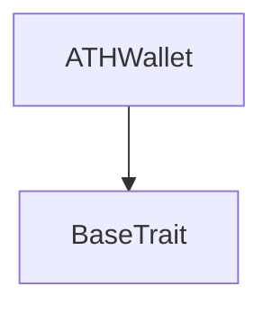
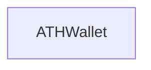

# Tact compilation report
Contract: ATHWallet
BoC Size: 6572 bytes

## Structures (Structs and Messages)
Total structures: 47

### DataSize
TL-B: `_ cells:int257 bits:int257 refs:int257 = DataSize`
Signature: `DataSize{cells:int257,bits:int257,refs:int257}`

### SignedBundle
TL-B: `_ signature:fixed_bytes64 signedData:remainder<slice> = SignedBundle`
Signature: `SignedBundle{signature:fixed_bytes64,signedData:remainder<slice>}`

### StateInit
TL-B: `_ code:^cell data:^cell = StateInit`
Signature: `StateInit{code:^cell,data:^cell}`

### Context
TL-B: `_ bounceable:bool sender:address value:int257 raw:^slice = Context`
Signature: `Context{bounceable:bool,sender:address,value:int257,raw:^slice}`

### SendParameters
TL-B: `_ mode:int257 body:Maybe ^cell code:Maybe ^cell data:Maybe ^cell value:int257 to:address bounce:bool = SendParameters`
Signature: `SendParameters{mode:int257,body:Maybe ^cell,code:Maybe ^cell,data:Maybe ^cell,value:int257,to:address,bounce:bool}`

### MessageParameters
TL-B: `_ mode:int257 body:Maybe ^cell value:int257 to:address bounce:bool = MessageParameters`
Signature: `MessageParameters{mode:int257,body:Maybe ^cell,value:int257,to:address,bounce:bool}`

### DeployParameters
TL-B: `_ mode:int257 body:Maybe ^cell value:int257 bounce:bool init:StateInit{code:^cell,data:^cell} = DeployParameters`
Signature: `DeployParameters{mode:int257,body:Maybe ^cell,value:int257,bounce:bool,init:StateInit{code:^cell,data:^cell}}`

### StdAddress
TL-B: `_ workchain:int8 address:uint256 = StdAddress`
Signature: `StdAddress{workchain:int8,address:uint256}`

### VarAddress
TL-B: `_ workchain:int32 address:^slice = VarAddress`
Signature: `VarAddress{workchain:int32,address:^slice}`

### BasechainAddress
TL-B: `_ hash:Maybe int257 = BasechainAddress`
Signature: `BasechainAddress{hash:Maybe int257}`

### ATHBurn
TL-B: `ath_burn#41544801 query_id:uint64 amount:uint128 response_destination:address = ATHBurn`
Signature: `ATHBurn{query_id:uint64,amount:uint128,response_destination:address}`

### ATHBurnNotification
TL-B: `ath_burn_notification#41544802 query_id:uint64 amount:uint128 owner_address:address response_destination:address = ATHBurnNotification`
Signature: `ATHBurnNotification{query_id:uint64,amount:uint128,owner_address:address,response_destination:address}`

### ATHBurnFinalized
TL-B: `ath_burn_finalized#41544803 query_id:uint64 amount:uint128 owner_address:address = ATHBurnFinalized`
Signature: `ATHBurnFinalized{query_id:uint64,amount:uint128,owner_address:address}`

### ATHBurnFailed
TL-B: `ath_burn_failed#41544804 query_id:uint64 amount:uint128 = ATHBurnFailed`
Signature: `ATHBurnFailed{query_id:uint64,amount:uint128}`

### ATHGenesisSupplyCredit
TL-B: `ath_genesis_supply_credit#41544805 query_id:uint64 amount:uint128 response_destination:address = ATHGenesisSupplyCredit`
Signature: `ATHGenesisSupplyCredit{query_id:uint64,amount:uint128,response_destination:address}`

### ATHGenesisSupplyAck
TL-B: `ath_genesis_supply_ack#41544806 query_id:uint64 amount:uint128 owner_address:address = ATHGenesisSupplyAck`
Signature: `ATHGenesisSupplyAck{query_id:uint64,amount:uint128,owner_address:address}`

### AthTransferNotification
TL-B: `ath_transfer_notification#472d9d7d query_id:uint64 sender_key:uint160 amount:uint128 sender_wallet:address = AthTransferNotification`
Signature: `AthTransferNotification{query_id:uint64,sender_key:uint160,amount:uint128,sender_wallet:address}`

### AthTransferNotificationAck
TL-B: `ath_transfer_notification_ack#472d9d7e query_id:uint64 amount:uint128 sender_key:uint160 = AthTransferNotificationAck`
Signature: `AthTransferNotificationAck{query_id:uint64,amount:uint128,sender_key:uint160}`

### AthTransferNotificationRefund
TL-B: `ath_transfer_notification_refund#4154481e query_id:uint64 amount:uint128 sender_key:uint160 = AthTransferNotificationRefund`
Signature: `AthTransferNotificationRefund{query_id:uint64,amount:uint128,sender_key:uint160}`

### PruneStaleNotification
TL-B: `prune_stale_notification#504e5052 query_id:uint64 sender_key:uint160 = PruneStaleNotification`
Signature: `PruneStaleNotification{query_id:uint64,sender_key:uint160}`

### AthTransferNotificationRegistryMintUsername
TL-B: `ath_transfer_notification_registry_mint_username#89129d60 query_id:uint64 sender_key:uint160 amount:uint128 payer_wallet:address owner_wallet:address username_len:uint8 username:^cell = AthTransferNotificationRegistryMintUsername`
Signature: `AthTransferNotificationRegistryMintUsername{query_id:uint64,sender_key:uint160,amount:uint128,payer_wallet:address,owner_wallet:address,username_len:uint8,username:^cell}`

### AthTransferNotificationRegistryProfileAvatar
TL-B: `ath_transfer_notification_registry_profile_avatar#a11a7002 query_id:uint64 sender_key:uint160 amount:uint128 payer_wallet:address owner_wallet:address avatar_hash:uint256 avatar_entry_id:uint64 avatar_stream_id:uint128 avatar_part_count:uint16 media_format:uint8 = AthTransferNotificationRegistryProfileAvatar`
Signature: `AthTransferNotificationRegistryProfileAvatar{query_id:uint64,sender_key:uint160,amount:uint128,payer_wallet:address,owner_wallet:address,avatar_hash:uint256,avatar_entry_id:uint64,avatar_stream_id:uint128,avatar_part_count:uint16,media_format:uint8}`

### ATHTransferRequest
TL-B: `ath_transfer_request#41544810 query_id:uint64 amount:uint128 recipient:address response_destination:address = ATHTransferRequest`
Signature: `ATHTransferRequest{query_id:uint64,amount:uint128,recipient:address,response_destination:address}`

### ATHTransferRequestWithNotify
TL-B: `ath_transfer_request_with_notify#41544814 query_id:uint64 amount:uint128 recipient:address response_destination:address notify_destination:address notify_value:uint128 = ATHTransferRequestWithNotify`
Signature: `ATHTransferRequestWithNotify{query_id:uint64,amount:uint128,recipient:address,response_destination:address,notify_destination:address,notify_value:uint128}`

### ATHTransferRequestRegistryProfileAvatar
TL-B: `ath_transfer_request_registry_profile_avatar#4154481a query_id:uint64 amount:uint128 recipient:address response_destination:address notify_value:uint128 owner_wallet:address avatar_hash:uint256 avatar_entry_id:uint64 avatar_stream_id:uint128 avatar_part_count:uint16 media_format:uint8 = ATHTransferRequestRegistryProfileAvatar`
Signature: `ATHTransferRequestRegistryProfileAvatar{query_id:uint64,amount:uint128,recipient:address,response_destination:address,notify_value:uint128,owner_wallet:address,avatar_hash:uint256,avatar_entry_id:uint64,avatar_stream_id:uint128,avatar_part_count:uint16,media_format:uint8}`

### ATHTransferRequestRegistryMintUsername
TL-B: `ath_transfer_request_registry_mint_username#4154481c query_id:uint64 amount:uint128 recipient:address response_destination:address notify_value:uint128 owner_wallet:address username_len:uint8 username:remainder<slice> = ATHTransferRequestRegistryMintUsername`
Signature: `ATHTransferRequestRegistryMintUsername{query_id:uint64,amount:uint128,recipient:address,response_destination:address,notify_value:uint128,owner_wallet:address,username_len:uint8,username:remainder<slice>}`

### ATHInternalTransfer
TL-B: `ath_internal_transfer#41544812 query_id:uint64 amount:uint128 sender_owner:address response_destination:address = ATHInternalTransfer`
Signature: `ATHInternalTransfer{query_id:uint64,amount:uint128,sender_owner:address,response_destination:address}`

### ATHInternalTransferWithNotify
TL-B: `ath_internal_transfer_with_notify#41544815 query_id:uint64 amount:uint128 sender_owner:address response_destination:address notify_destination:address notify_value:uint128 = ATHInternalTransferWithNotify`
Signature: `ATHInternalTransferWithNotify{query_id:uint64,amount:uint128,sender_owner:address,response_destination:address,notify_destination:address,notify_value:uint128}`

### ATHInternalTransferRegistryProfileAvatar
TL-B: `ath_internal_transfer_registry_profile_avatar#4154481b query_id:uint64 amount:uint128 sender_owner:address response_destination:address notify_value:uint128 owner_wallet:address avatar_hash:uint256 avatar_entry_id:uint64 avatar_stream_id:uint128 avatar_part_count:uint16 media_format:uint8 = ATHInternalTransferRegistryProfileAvatar`
Signature: `ATHInternalTransferRegistryProfileAvatar{query_id:uint64,amount:uint128,sender_owner:address,response_destination:address,notify_value:uint128,owner_wallet:address,avatar_hash:uint256,avatar_entry_id:uint64,avatar_stream_id:uint128,avatar_part_count:uint16,media_format:uint8}`

### ATHInternalTransferRegistryMintUsername
TL-B: `ath_internal_transfer_registry_mint_username#4154481d query_id:uint64 amount:uint128 sender_owner:address response_destination:address notify_value:uint128 owner_wallet:address username_len:uint8 username:remainder<slice> = ATHInternalTransferRegistryMintUsername`
Signature: `ATHInternalTransferRegistryMintUsername{query_id:uint64,amount:uint128,sender_owner:address,response_destination:address,notify_value:uint128,owner_wallet:address,username_len:uint8,username:remainder<slice>}`

### ATHTransferAck
TL-B: `ath_transfer_ack#41544811 query_id:uint64 amount:uint128 = ATHTransferAck`
Signature: `ATHTransferAck{query_id:uint64,amount:uint128}`

### ATHTransferFailed
TL-B: `ath_transfer_failed#41544813 query_id:uint64 amount:uint128 = ATHTransferFailed`
Signature: `ATHTransferFailed{query_id:uint64,amount:uint128}`

### JettonTransfer
TL-B: `jetton_transfer#0f8a7ea5 query_id:uint64 amount:coins destination:address response_destination:address custom_payload:Maybe ^cell forward_ton_amount:coins forward_payload:remainder<slice> = JettonTransfer`
Signature: `JettonTransfer{query_id:uint64,amount:coins,destination:address,response_destination:address,custom_payload:Maybe ^cell,forward_ton_amount:coins,forward_payload:remainder<slice>}`

### JettonInternalTransfer
TL-B: `jetton_internal_transfer#178d4519 query_id:uint64 amount:coins from:address response_address:address forward_ton_amount:coins forward_payload:remainder<slice> = JettonInternalTransfer`
Signature: `JettonInternalTransfer{query_id:uint64,amount:coins,from:address,response_address:address,forward_ton_amount:coins,forward_payload:remainder<slice>}`

### JettonTransferNotification
TL-B: `jetton_transfer_notification#7362d09c query_id:uint64 amount:coins sender:address forward_payload:remainder<slice> = JettonTransferNotification`
Signature: `JettonTransferNotification{query_id:uint64,amount:coins,sender:address,forward_payload:remainder<slice>}`

### JettonExcesses
TL-B: `jetton_excesses#d53276db query_id:uint64 = JettonExcesses`
Signature: `JettonExcesses{query_id:uint64}`

### ATHWalletTopUpStorageReserve
TL-B: `ath_wallet_top_up_storage_reserve#41544807  = ATHWalletTopUpStorageReserve`
Signature: `ATHWalletTopUpStorageReserve{}`

### ATHRecoverStuckOutgoing
TL-B: `ath_recover_stuck_outgoing#41544808 query_id:uint64 recipient_wallet:address = ATHRecoverStuckOutgoing`
Signature: `ATHRecoverStuckOutgoing{query_id:uint64,recipient_wallet:address}`

### ATHWalletDataView
TL-B: `_ balance:int257 owner_address:address ath_master_address:address jetton_wallet_code:^cell = ATHWalletDataView`
Signature: `ATHWalletDataView{balance:int257,owner_address:address,ath_master_address:address,jetton_wallet_code:^cell}`

### PendingAthTransferNotificationView
TL-B: `_ exists:bool sender_owner:address response_destination:address amount:int257 created_at:int257 = PendingAthTransferNotificationView`
Signature: `PendingAthTransferNotificationView{exists:bool,sender_owner:address,response_destination:address,amount:int257,created_at:int257}`

### PendingAthTransferNotification
TL-B: `_ sender_owner:address response_destination:address response_ack_value:uint64 amount:uint128 created_at:uint64 = PendingAthTransferNotification`
Signature: `PendingAthTransferNotification{sender_owner:address,response_destination:address,response_ack_value:uint64,amount:uint128,created_at:uint64}`

### PendingAthOutgoingTransfer
TL-B: `_ recipient_wallet:address response_destination:address amount:uint128 created_at:uint64 = PendingAthOutgoingTransfer`
Signature: `PendingAthOutgoingTransfer{recipient_wallet:address,response_destination:address,amount:uint128,created_at:uint64}`

### ATHWallet$Data
TL-B: `_ balance:uint128 owner_address:address ath_master_address:address pending_notifications:dict<int, ^PendingAthTransferNotification{sender_owner:address,response_destination:address,response_ack_value:uint64,amount:uint128,created_at:uint64}> pending_outgoing_transfers:dict<int, ^PendingAthOutgoingTransfer{recipient_wallet:address,response_destination:address,amount:uint128,created_at:uint64}> = ATHWallet`
Signature: `ATHWallet{balance:uint128,owner_address:address,ath_master_address:address,pending_notifications:dict<int, ^PendingAthTransferNotification{sender_owner:address,response_destination:address,response_ack_value:uint64,amount:uint128,created_at:uint64}>,pending_outgoing_transfers:dict<int, ^PendingAthOutgoingTransfer{recipient_wallet:address,response_destination:address,amount:uint128,created_at:uint64}>}`

### DeployTreasurySupply
TL-B: `deploy_treasury_supply#41544809 query_id:uint64 response_destination:address = DeployTreasurySupply`
Signature: `DeployTreasurySupply{query_id:uint64,response_destination:address}`

### ATHMasterTopUpStorageReserve
TL-B: `ath_master_top_up_storage_reserve#4154480a  = ATHMasterTopUpStorageReserve`
Signature: `ATHMasterTopUpStorageReserve{}`

### ATHJettonDataView
TL-B: `_ total_supply:int257 mintable:bool admin_address:address jetton_content:^cell jetton_wallet_code:^cell = ATHJettonDataView`
Signature: `ATHJettonDataView{total_supply:int257,mintable:bool,admin_address:address,jetton_content:^cell,jetton_wallet_code:^cell}`

### ATHMaster$Data
TL-B: `_ total_supply:uint128 treasury_owner:address content:^cell treasury_supply_deployed:bool = ATHMaster`
Signature: `ATHMaster{total_supply:uint128,treasury_owner:address,content:^cell,treasury_supply_deployed:bool}`

## Get methods
Total get methods: 2

## get_wallet_data
No arguments

## get_pending_notification
Argument: query_id
Argument: sender_key

## Exit codes
* 2: Stack underflow
* 3: Stack overflow
* 4: Integer overflow
* 5: Integer out of expected range
* 6: Invalid opcode
* 7: Type check error
* 8: Cell overflow
* 9: Cell underflow
* 10: Dictionary error
* 11: 'Unknown' error
* 12: Fatal error
* 13: Out of gas error
* 14: Virtualization error
* 32: Action list is invalid
* 33: Action list is too long
* 34: Action is invalid or not supported
* 35: Invalid source address in outbound message
* 36: Invalid destination address in outbound message
* 37: Not enough Toncoin
* 38: Not enough extra currencies
* 39: Outbound message does not fit into a cell after rewriting
* 40: Cannot process a message
* 41: Library reference is null
* 42: Library change action error
* 43: Exceeded maximum number of cells in the library or the maximum depth of the Merkle tree
* 50: Account state size exceeded limits
* 128: Null reference exception
* 129: Invalid serialization prefix
* 130: Invalid incoming message
* 131: Constraints error
* 132: Access denied
* 133: Contract stopped
* 134: Invalid argument
* 135: Code of a contract was not found
* 136: Invalid standard address
* 138: Not a basechain address

## Trait inheritance diagram

## Contract dependency diagram

