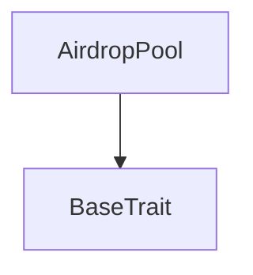
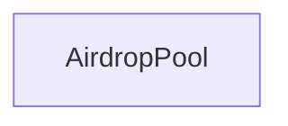

# Tact compilation report
Contract: AirdropPool
BoC Size: 2816 bytes

## Structures (Structs and Messages)
Total structures: 25

### DataSize
TL-B: `_ cells:int257 bits:int257 refs:int257 = DataSize`
Signature: `DataSize{cells:int257,bits:int257,refs:int257}`

### SignedBundle
TL-B: `_ signature:fixed_bytes64 signedData:remainder<slice> = SignedBundle`
Signature: `SignedBundle{signature:fixed_bytes64,signedData:remainder<slice>}`

### StateInit
TL-B: `_ code:^cell data:^cell = StateInit`
Signature: `StateInit{code:^cell,data:^cell}`

### Context
TL-B: `_ bounceable:bool sender:address value:int257 raw:^slice = Context`
Signature: `Context{bounceable:bool,sender:address,value:int257,raw:^slice}`

### SendParameters
TL-B: `_ mode:int257 body:Maybe ^cell code:Maybe ^cell data:Maybe ^cell value:int257 to:address bounce:bool = SendParameters`
Signature: `SendParameters{mode:int257,body:Maybe ^cell,code:Maybe ^cell,data:Maybe ^cell,value:int257,to:address,bounce:bool}`

### MessageParameters
TL-B: `_ mode:int257 body:Maybe ^cell value:int257 to:address bounce:bool = MessageParameters`
Signature: `MessageParameters{mode:int257,body:Maybe ^cell,value:int257,to:address,bounce:bool}`

### DeployParameters
TL-B: `_ mode:int257 body:Maybe ^cell value:int257 bounce:bool init:StateInit{code:^cell,data:^cell} = DeployParameters`
Signature: `DeployParameters{mode:int257,body:Maybe ^cell,value:int257,bounce:bool,init:StateInit{code:^cell,data:^cell}}`

### StdAddress
TL-B: `_ workchain:int8 address:uint256 = StdAddress`
Signature: `StdAddress{workchain:int8,address:uint256}`

### VarAddress
TL-B: `_ workchain:int32 address:^slice = VarAddress`
Signature: `VarAddress{workchain:int32,address:^slice}`

### BasechainAddress
TL-B: `_ hash:Maybe int257 = BasechainAddress`
Signature: `BasechainAddress{hash:Maybe int257}`

### AirdropBindAthMaster
TL-B: `airdrop_bind_ath_master#41445201 ath_master_address:address pool_ath_wallet_address:address = AirdropBindAthMaster`
Signature: `AirdropBindAthMaster{ath_master_address:address,pool_ath_wallet_address:address}`

### AirdropBindCreditIssuer
TL-B: `airdrop_bind_credit_issuer#41445202 credit_issuer_address:address = AirdropBindCreditIssuer`
Signature: `AirdropBindCreditIssuer{credit_issuer_address:address}`

### AirdropRebindCreditIssuer
TL-B: `airdrop_rebind_credit_issuer#41445239 deployment_manifest_hash:uint256 credit_issuer_address:address = AirdropRebindCreditIssuer`
Signature: `AirdropRebindCreditIssuer{deployment_manifest_hash:uint256,credit_issuer_address:address}`

### AirdropBindTreasury
TL-B: `airdrop_bind_treasury#41445203 treasury_address:address = AirdropBindTreasury`
Signature: `AirdropBindTreasury{treasury_address:address}`

### AirdropSealGenesis
TL-B: `airdrop_seal_genesis#41445204 deployment_manifest_hash:uint256 = AirdropSealGenesis`
Signature: `AirdropSealGenesis{deployment_manifest_hash:uint256}`

### AirdropAccrue
TL-B: `airdrop_accrue#41445210 purchase_id:uint64 buyer:address credits_k:uint32 = AirdropAccrue`
Signature: `AirdropAccrue{purchase_id:uint64,buyer:address,credits_k:uint32}`

### AirdropTopUpStorageReserve
TL-B: `airdrop_top_up_storage_reserve#41445211  = AirdropTopUpStorageReserve`
Signature: `AirdropTopUpStorageReserve{}`

### AirdropSweepResidualToTreasury
TL-B: `airdrop_sweep_residual_to_treasury#41445212  = AirdropSweepResidualToTreasury`
Signature: `AirdropSweepResidualToTreasury{}`

### AirdropSweepUnaccountedTon
TL-B: `airdrop_sweep_unaccounted_ton#41445213  = AirdropSweepUnaccountedTon`
Signature: `AirdropSweepUnaccountedTon{}`

### ATHTransferExcess
TL-B: `ath_transfer_excess#4154481f query_id:uint64 = ATHTransferExcess`
Signature: `ATHTransferExcess{query_id:uint64}`

### ATHTransferRequest
TL-B: `ath_transfer_request#41544810 query_id:uint64 amount:uint128 recipient:address response_destination:address = ATHTransferRequest`
Signature: `ATHTransferRequest{query_id:uint64,amount:uint128,recipient:address,response_destination:address}`

### AthTransferNotification
TL-B: `ath_transfer_notification#472d9d7d query_id:uint64 sender_key:uint160 amount:uint128 sender_wallet:address = AthTransferNotification`
Signature: `AthTransferNotification{query_id:uint64,sender_key:uint160,amount:uint128,sender_wallet:address}`

### AthTransferNotificationAck
TL-B: `ath_transfer_notification_ack#472d9d7e query_id:uint64 amount:uint128 sender_key:uint160 = AthTransferNotificationAck`
Signature: `AthTransferNotificationAck{query_id:uint64,amount:uint128,sender_key:uint160}`

### AirdropGlobalView
TL-B: `_ sealed:bool deployment_manifest_hash:int257 genesis_config_hash:int257 genesis_controller_address:address ath_master_address:address pool_ath_wallet_address:address credit_issuer_address:address treasury_address:address ath_per_credit:int257 total_pool:int257 funded_amount:int257 remaining_budget:int257 distributed_total:int257 claim_count:int257 sealed_at:int257 ath_master_bound:bool credit_issuer_bound:bool treasury_bound:bool = AirdropGlobalView`
Signature: `AirdropGlobalView{sealed:bool,deployment_manifest_hash:int257,genesis_config_hash:int257,genesis_controller_address:address,ath_master_address:address,pool_ath_wallet_address:address,credit_issuer_address:address,treasury_address:address,ath_per_credit:int257,total_pool:int257,funded_amount:int257,remaining_budget:int257,distributed_total:int257,claim_count:int257,sealed_at:int257,ath_master_bound:bool,credit_issuer_bound:bool,treasury_bound:bool}`

### AirdropPool$Data
TL-B: `_ sealed:bool genesis_controller_address:address deployment_manifest_hash:uint256 genesis_config_hash:uint256 deployment_id:uint32 ath_master_address:address pool_ath_wallet_address:address ath_master_bound:bool credit_issuer_address:address credit_issuer_bound:bool treasury_address:address treasury_bound:bool funded_amount:uint128 remaining_budget:uint128 distributed_total:uint128 claim_count:uint64 sealed_at:uint64 payout_seq:uint64 last_accrual_at:uint64 = AirdropPool`
Signature: `AirdropPool{sealed:bool,genesis_controller_address:address,deployment_manifest_hash:uint256,genesis_config_hash:uint256,deployment_id:uint32,ath_master_address:address,pool_ath_wallet_address:address,ath_master_bound:bool,credit_issuer_address:address,credit_issuer_bound:bool,treasury_address:address,treasury_bound:bool,funded_amount:uint128,remaining_budget:uint128,distributed_total:uint128,claim_count:uint64,sealed_at:uint64,payout_seq:uint64,last_accrual_at:uint64}`

## Get methods
Total get methods: 1

## get_global
No arguments

## Exit codes
* 2: Stack underflow
* 3: Stack overflow
* 4: Integer overflow
* 5: Integer out of expected range
* 6: Invalid opcode
* 7: Type check error
* 8: Cell overflow
* 9: Cell underflow
* 10: Dictionary error
* 11: 'Unknown' error
* 12: Fatal error
* 13: Out of gas error
* 14: Virtualization error
* 32: Action list is invalid
* 33: Action list is too long
* 34: Action is invalid or not supported
* 35: Invalid source address in outbound message
* 36: Invalid destination address in outbound message
* 37: Not enough Toncoin
* 38: Not enough extra currencies
* 39: Outbound message does not fit into a cell after rewriting
* 40: Cannot process a message
* 41: Library reference is null
* 42: Library change action error
* 43: Exceeded maximum number of cells in the library or the maximum depth of the Merkle tree
* 50: Account state size exceeded limits
* 128: Null reference exception
* 129: Invalid serialization prefix
* 130: Invalid incoming message
* 131: Constraints error
* 132: Access denied
* 133: Contract stopped
* 134: Invalid argument
* 135: Code of a contract was not found
* 136: Invalid standard address
* 138: Not a basechain address

## Trait inheritance diagram

## Contract dependency diagram

