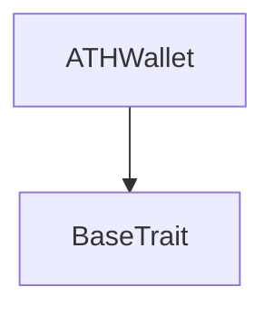
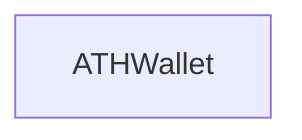

# Tact compilation report
Contract: ATHWallet
BoC Size: 3503 bytes

## Structures (Structs and Messages)
Total structures: 46

### DataSize
TL-B: `_ cells:int257 bits:int257 refs:int257 = DataSize`
Signature: `DataSize{cells:int257,bits:int257,refs:int257}`

### SignedBundle
TL-B: `_ signature:fixed_bytes64 signedData:remainder<slice> = SignedBundle`
Signature: `SignedBundle{signature:fixed_bytes64,signedData:remainder<slice>}`

### StateInit
TL-B: `_ code:^cell data:^cell = StateInit`
Signature: `StateInit{code:^cell,data:^cell}`

### Context
TL-B: `_ bounceable:bool sender:address value:int257 raw:^slice = Context`
Signature: `Context{bounceable:bool,sender:address,value:int257,raw:^slice}`

### SendParameters
TL-B: `_ mode:int257 body:Maybe ^cell code:Maybe ^cell data:Maybe ^cell value:int257 to:address bounce:bool = SendParameters`
Signature: `SendParameters{mode:int257,body:Maybe ^cell,code:Maybe ^cell,data:Maybe ^cell,value:int257,to:address,bounce:bool}`

### MessageParameters
TL-B: `_ mode:int257 body:Maybe ^cell value:int257 to:address bounce:bool = MessageParameters`
Signature: `MessageParameters{mode:int257,body:Maybe ^cell,value:int257,to:address,bounce:bool}`

### DeployParameters
TL-B: `_ mode:int257 body:Maybe ^cell value:int257 bounce:bool init:StateInit{code:^cell,data:^cell} = DeployParameters`
Signature: `DeployParameters{mode:int257,body:Maybe ^cell,value:int257,bounce:bool,init:StateInit{code:^cell,data:^cell}}`

### StdAddress
TL-B: `_ workchain:int8 address:uint256 = StdAddress`
Signature: `StdAddress{workchain:int8,address:uint256}`

### VarAddress
TL-B: `_ workchain:int32 address:^slice = VarAddress`
Signature: `VarAddress{workchain:int32,address:^slice}`

### BasechainAddress
TL-B: `_ hash:Maybe int257 = BasechainAddress`
Signature: `BasechainAddress{hash:Maybe int257}`

### ATHBurn
TL-B: `ath_burn#41544801 query_id:uint64 amount:uint128 response_destination:address = ATHBurn`
Signature: `ATHBurn{query_id:uint64,amount:uint128,response_destination:address}`

### ATHBurnNotification
TL-B: `ath_burn_notification#41544802 query_id:uint64 amount:uint128 owner_address:address response_destination:address = ATHBurnNotification`
Signature: `ATHBurnNotification{query_id:uint64,amount:uint128,owner_address:address,response_destination:address}`

### ATHBurnFinalized
TL-B: `ath_burn_finalized#41544803 query_id:uint64 amount:uint128 owner_address:address = ATHBurnFinalized`
Signature: `ATHBurnFinalized{query_id:uint64,amount:uint128,owner_address:address}`

### ATHBurnFailed
TL-B: `ath_burn_failed#41544804 query_id:uint64 amount:uint128 = ATHBurnFailed`
Signature: `ATHBurnFailed{query_id:uint64,amount:uint128}`

### ATHGenesisSupplyCredit
TL-B: `ath_genesis_supply_credit#41544805 query_id:uint64 amount:uint128 response_destination:address = ATHGenesisSupplyCredit`
Signature: `ATHGenesisSupplyCredit{query_id:uint64,amount:uint128,response_destination:address}`

### ATHGenesisSupplyAck
TL-B: `ath_genesis_supply_ack#41544806 query_id:uint64 amount:uint128 owner_address:address = ATHGenesisSupplyAck`
Signature: `ATHGenesisSupplyAck{query_id:uint64,amount:uint128,owner_address:address}`

### AthTransferNotification
TL-B: `ath_transfer_notification#472d9d7d query_id:uint64 amount:uint128 sender_key:uint32 sender_wallet:address = AthTransferNotification`
Signature: `AthTransferNotification{query_id:uint64,amount:uint128,sender_key:uint32,sender_wallet:address}`

### AthTransferNotificationAck
TL-B: `ath_transfer_notification_ack#472d9d7e query_id:uint64 amount:uint128 sender_key:uint32 = AthTransferNotificationAck`
Signature: `AthTransferNotificationAck{query_id:uint64,amount:uint128,sender_key:uint32}`

### PruneStaleNotification
TL-B: `prune_stale_notification#504e5052 query_id:uint64 sender_key:uint32 = PruneStaleNotification`
Signature: `PruneStaleNotification{query_id:uint64,sender_key:uint32}`

### AthTransferNotificationMintUsername
TL-B: `ath_transfer_notification_mint_username#89129d5f query_id:uint64 amount:uint128 sender_key:uint32 owner_wallet:address username_len:uint8 username:remainder<slice> = AthTransferNotificationMintUsername`
Signature: `AthTransferNotificationMintUsername{query_id:uint64,amount:uint128,sender_key:uint32,owner_wallet:address,username_len:uint8,username:remainder<slice>}`

### ATHTransferRequest
TL-B: `ath_transfer_request#41544810 query_id:uint64 amount:uint128 recipient:address response_destination:address = ATHTransferRequest`
Signature: `ATHTransferRequest{query_id:uint64,amount:uint128,recipient:address,response_destination:address}`

### ATHTransferRequestWithNotify
TL-B: `ath_transfer_request_with_notify#41544814 query_id:uint64 amount:uint128 recipient:address response_destination:address notify_destination:address notify_value:uint128 = ATHTransferRequestWithNotify`
Signature: `ATHTransferRequestWithNotify{query_id:uint64,amount:uint128,recipient:address,response_destination:address,notify_destination:address,notify_value:uint128}`

### ATHTransferRequestMintUsername
TL-B: `ath_transfer_request_mint_username#41544816 query_id:uint64 amount:uint128 recipient:address response_destination:address notify_value:uint128 username_len:uint8 username:remainder<slice> = ATHTransferRequestMintUsername`
Signature: `ATHTransferRequestMintUsername{query_id:uint64,amount:uint128,recipient:address,response_destination:address,notify_value:uint128,username_len:uint8,username:remainder<slice>}`

### ATHInternalTransfer
TL-B: `ath_internal_transfer#41544812 query_id:uint64 amount:uint128 sender_owner:address response_destination:address = ATHInternalTransfer`
Signature: `ATHInternalTransfer{query_id:uint64,amount:uint128,sender_owner:address,response_destination:address}`

### ATHInternalTransferWithNotify
TL-B: `ath_internal_transfer_with_notify#41544815 query_id:uint64 amount:uint128 sender_owner:address response_destination:address notify_destination:address notify_value:uint128 = ATHInternalTransferWithNotify`
Signature: `ATHInternalTransferWithNotify{query_id:uint64,amount:uint128,sender_owner:address,response_destination:address,notify_destination:address,notify_value:uint128}`

### ATHInternalTransferMintUsername
TL-B: `ath_internal_transfer_mint_username#41544817 query_id:uint64 amount:uint128 sender_owner:address response_destination:address notify_value:uint128 username_len:uint8 username:remainder<slice> = ATHInternalTransferMintUsername`
Signature: `ATHInternalTransferMintUsername{query_id:uint64,amount:uint128,sender_owner:address,response_destination:address,notify_value:uint128,username_len:uint8,username:remainder<slice>}`

### ATHTransferAck
TL-B: `ath_transfer_ack#41544811 query_id:uint64 amount:uint128 = ATHTransferAck`
Signature: `ATHTransferAck{query_id:uint64,amount:uint128}`

### ATHTransferFailed
TL-B: `ath_transfer_failed#41544813 query_id:uint64 amount:uint128 = ATHTransferFailed`
Signature: `ATHTransferFailed{query_id:uint64,amount:uint128}`

### ATHWalletDataView
TL-B: `_ balance:int257 owner_address:address ath_master_address:address = ATHWalletDataView`
Signature: `ATHWalletDataView{balance:int257,owner_address:address,ath_master_address:address}`

### PendingAthTransferNotificationView
TL-B: `_ exists:bool sender_owner:address amount:int257 created_at:int257 = PendingAthTransferNotificationView`
Signature: `PendingAthTransferNotificationView{exists:bool,sender_owner:address,amount:int257,created_at:int257}`

### PendingAthTransferNotification
TL-B: `_ sender_owner:address amount:uint128 created_at:uint32 = PendingAthTransferNotification`
Signature: `PendingAthTransferNotification{sender_owner:address,amount:uint128,created_at:uint32}`

### ATHWallet$Data
TL-B: `_ balance:uint128 owner_address:address ath_master_address:address pending_notifications:dict<int, ^PendingAthTransferNotification{sender_owner:address,amount:uint128,created_at:uint32}> processed_notifications:dict<int, int> = ATHWallet`
Signature: `ATHWallet{balance:uint128,owner_address:address,ath_master_address:address,pending_notifications:dict<int, ^PendingAthTransferNotification{sender_owner:address,amount:uint128,created_at:uint32}>,processed_notifications:dict<int, int>}`

### AcceptBurnReserve
TL-B: `accept_burn_reserve#594ba505 amount:uint128 = AcceptBurnReserve`
Signature: `AcceptBurnReserve{amount:uint128}`

### BindBuybackFeeAccumulator
TL-B: `bind_buyback_fee_accumulator#42594641 deployment_manifest_hash:uint256 fee_accumulator_address:address = BindBuybackFeeAccumulator`
Signature: `BindBuybackFeeAccumulator{deployment_manifest_hash:uint256,fee_accumulator_address:address}`

### BindBuybackOfficialAthWallet
TL-B: `bind_buyback_official_ath_wallet#42594157 deployment_manifest_hash:uint256 official_ath_wallet_address:address = BindBuybackOfficialAthWallet`
Signature: `BindBuybackOfficialAthWallet{deployment_manifest_hash:uint256,official_ath_wallet_address:address}`

### FreezeBuybackRoute
TL-B: `freeze_buyback_route#42595246 deployment_manifest_hash:uint256 stonfi_router_address:address stonfi_pool_address_ton_ath:address stonfi_pton_wallet_address:address ask_jetton_wallet_address:address stonfi_referral_address:address referral_value_bps:uint16 buyback_min_ath_out_per_50_ton_atomic:uint128 evidence_quote_out_atomic_ath:uint128 evidence_dex_min_out_atomic_ath:uint128 route_evidence_hash:uint256 = FreezeBuybackRoute`
Signature: `FreezeBuybackRoute{deployment_manifest_hash:uint256,stonfi_router_address:address,stonfi_pool_address_ton_ath:address,stonfi_pton_wallet_address:address,ask_jetton_wallet_address:address,stonfi_referral_address:address,referral_value_bps:uint16,buyback_min_ath_out_per_50_ton_atomic:uint128,evidence_quote_out_atomic_ath:uint128,evidence_dex_min_out_atomic_ath:uint128,route_evidence_hash:uint256}`

### SealBuybackBurnGenesis
TL-B: `seal_buyback_burn_genesis#4259534c deployment_manifest_hash:uint256 = SealBuybackBurnGenesis`
Signature: `SealBuybackBurnGenesis{deployment_manifest_hash:uint256}`

### ExecuteBuybackChunk
TL-B: `execute_buyback_chunk#42594558 query_id:uint64 deadline:uint64 quote_out_atomic_ath:uint128 dex_min_out_atomic_ath:uint128 = ExecuteBuybackChunk`
Signature: `ExecuteBuybackChunk{query_id:uint64,deadline:uint64,quote_out_atomic_ath:uint128,dex_min_out_atomic_ath:uint128}`

### RetryAthBurnDue
TL-B: `retry_ath_burn_due#42595254 query_id:uint64 amount:uint128 = RetryAthBurnDue`
Signature: `RetryAthBurnDue{query_id:uint64,amount:uint128}`

### RecoverStonfiRouteRefund
TL-B: `recover_stonfi_route_refund#42595243 query_id:uint64 = RecoverStonfiRouteRefund`
Signature: `RecoverStonfiRouteRefund{query_id:uint64}`

### RecycleRouteRefundReserve
TL-B: `recycle_route_refund_reserve#42595252  = RecycleRouteRefundReserve`
Signature: `RecycleRouteRefundReserve{}`

### StonfiPtonTonTransferBounce
TL-B: `stonfi_pton_ton_transfer_bounce#01f3835d query_id:uint64 ton_amount:coins = StonfiPtonTonTransferBounce`
Signature: `StonfiPtonTonTransferBounce{query_id:uint64,ton_amount:coins}`

### BuybackBurnConfigView
TL-B: `_ sealed:bool fee_bound:bool official_ath_wallet_bound:bool route_frozen:bool deployment_manifest_hash:int257 genesis_config_hash:int257 ath_master_address:address fee_accumulator_address:address official_ath_wallet_address:address stonfi_router_address:address stonfi_pool_address_ton_ath:address stonfi_pton_wallet_address:address ask_jetton_wallet_address:address stonfi_referral_address:address referral_value_bps:int257 buyback_min_ath_out_per_50_ton_atomic:int257 evidence_quote_out_atomic_ath:int257 evidence_dex_min_out_atomic_ath:int257 route_evidence_hash:int257 = BuybackBurnConfigView`
Signature: `BuybackBurnConfigView{sealed:bool,fee_bound:bool,official_ath_wallet_bound:bool,route_frozen:bool,deployment_manifest_hash:int257,genesis_config_hash:int257,ath_master_address:address,fee_accumulator_address:address,official_ath_wallet_address:address,stonfi_router_address:address,stonfi_pool_address_ton_ath:address,stonfi_pton_wallet_address:address,ask_jetton_wallet_address:address,stonfi_referral_address:address,referral_value_bps:int257,buyback_min_ath_out_per_50_ton_atomic:int257,evidence_quote_out_atomic_ath:int257,evidence_dex_min_out_atomic_ath:int257,route_evidence_hash:int257}`

### BuybackBurnStateView
TL-B: `_ phase:int257 reserve_due_ton:int257 pending_query_id:int257 pending_deadline:int257 pending_route_refund_start_ton:int257 pending_dex_min_out_atomic_ath:int257 pending_received_ath_atomic:int257 route_refund_due_ton:int257 ath_burn_retry_due_atomic:int257 last_terminal_query_id:int257 = BuybackBurnStateView`
Signature: `BuybackBurnStateView{phase:int257,reserve_due_ton:int257,pending_query_id:int257,pending_deadline:int257,pending_route_refund_start_ton:int257,pending_dex_min_out_atomic_ath:int257,pending_received_ath_atomic:int257,route_refund_due_ton:int257,ath_burn_retry_due_atomic:int257,last_terminal_query_id:int257}`

### BuybackBurnTotalsView
TL-B: `_ accepted_reserve_count:int257 executed_buyback_count:int257 burned_ath_total_atomic:int257 = BuybackBurnTotalsView`
Signature: `BuybackBurnTotalsView{accepted_reserve_count:int257,executed_buyback_count:int257,burned_ath_total_atomic:int257}`

### BuybackBurn$Data
TL-B: `_ genesis_config_hash:uint256 deployment_manifest_hash:uint256 ath_master_address:address fee_accumulator_address:address official_ath_wallet_address:address stonfi_router_address:address stonfi_pool_address_ton_ath:address stonfi_pton_wallet_address:address ask_jetton_wallet_address:address stonfi_referral_address:address fee_bound:bool official_ath_wallet_bound:bool route_frozen:bool sealed:bool referral_value_bps:uint16 buyback_min_ath_out_per_50_ton_atomic:uint128 evidence_quote_out_atomic_ath:uint128 evidence_dex_min_out_atomic_ath:uint128 route_evidence_hash:uint256 phase:uint8 reserve_due_ton:uint128 pending_query_id:uint64 pending_deadline:uint64 pending_route_refund_start_ton:uint128 pending_dex_min_out_atomic_ath:uint128 pending_received_ath_atomic:uint128 route_refund_due_ton:uint128 ath_burn_retry_due_atomic:uint128 last_terminal_query_id:uint64 accepted_reserve_count:uint64 executed_buyback_count:uint64 burned_ath_total_atomic:uint128 = BuybackBurn`
Signature: `BuybackBurn{genesis_config_hash:uint256,deployment_manifest_hash:uint256,ath_master_address:address,fee_accumulator_address:address,official_ath_wallet_address:address,stonfi_router_address:address,stonfi_pool_address_ton_ath:address,stonfi_pton_wallet_address:address,ask_jetton_wallet_address:address,stonfi_referral_address:address,fee_bound:bool,official_ath_wallet_bound:bool,route_frozen:bool,sealed:bool,referral_value_bps:uint16,buyback_min_ath_out_per_50_ton_atomic:uint128,evidence_quote_out_atomic_ath:uint128,evidence_dex_min_out_atomic_ath:uint128,route_evidence_hash:uint256,phase:uint8,reserve_due_ton:uint128,pending_query_id:uint64,pending_deadline:uint64,pending_route_refund_start_ton:uint128,pending_dex_min_out_atomic_ath:uint128,pending_received_ath_atomic:uint128,route_refund_due_ton:uint128,ath_burn_retry_due_atomic:uint128,last_terminal_query_id:uint64,accepted_reserve_count:uint64,executed_buyback_count:uint64,burned_ath_total_atomic:uint128}`

## Get methods
Total get methods: 2

## get_wallet_data
No arguments

## get_pending_notification
Argument: query_id
Argument: sender_key

## Exit codes
* 2: Stack underflow
* 3: Stack overflow
* 4: Integer overflow
* 5: Integer out of expected range
* 6: Invalid opcode
* 7: Type check error
* 8: Cell overflow
* 9: Cell underflow
* 10: Dictionary error
* 11: 'Unknown' error
* 12: Fatal error
* 13: Out of gas error
* 14: Virtualization error
* 32: Action list is invalid
* 33: Action list is too long
* 34: Action is invalid or not supported
* 35: Invalid source address in outbound message
* 36: Invalid destination address in outbound message
* 37: Not enough Toncoin
* 38: Not enough extra currencies
* 39: Outbound message does not fit into a cell after rewriting
* 40: Cannot process a message
* 41: Library reference is null
* 42: Library change action error
* 43: Exceeded maximum number of cells in the library or the maximum depth of the Merkle tree
* 50: Account state size exceeded limits
* 128: Null reference exception
* 129: Invalid serialization prefix
* 130: Invalid incoming message
* 131: Constraints error
* 132: Access denied
* 133: Contract stopped
* 134: Invalid argument
* 135: Code of a contract was not found
* 136: Invalid standard address
* 138: Not a basechain address

## Trait inheritance diagram

## Contract dependency diagram

