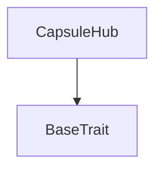

# Tact compilation report
Contract: CapsuleHub
BoC Size: 2872 bytes

## Structures (Structs and Messages)
Total structures: 24

### DataSize
TL-B: `_ cells:int257 bits:int257 refs:int257 = DataSize`
Signature: `DataSize{cells:int257,bits:int257,refs:int257}`

### SignedBundle
TL-B: `_ signature:fixed_bytes64 signedData:remainder<slice> = SignedBundle`
Signature: `SignedBundle{signature:fixed_bytes64,signedData:remainder<slice>}`

### StateInit
TL-B: `_ code:^cell data:^cell = StateInit`
Signature: `StateInit{code:^cell,data:^cell}`

### Context
TL-B: `_ bounceable:bool sender:address value:int257 raw:^slice = Context`
Signature: `Context{bounceable:bool,sender:address,value:int257,raw:^slice}`

### SendParameters
TL-B: `_ mode:int257 body:Maybe ^cell code:Maybe ^cell data:Maybe ^cell value:int257 to:address bounce:bool = SendParameters`
Signature: `SendParameters{mode:int257,body:Maybe ^cell,code:Maybe ^cell,data:Maybe ^cell,value:int257,to:address,bounce:bool}`

### MessageParameters
TL-B: `_ mode:int257 body:Maybe ^cell value:int257 to:address bounce:bool = MessageParameters`
Signature: `MessageParameters{mode:int257,body:Maybe ^cell,value:int257,to:address,bounce:bool}`

### DeployParameters
TL-B: `_ mode:int257 body:Maybe ^cell value:int257 bounce:bool init:StateInit{code:^cell,data:^cell} = DeployParameters`
Signature: `DeployParameters{mode:int257,body:Maybe ^cell,value:int257,bounce:bool,init:StateInit{code:^cell,data:^cell}}`

### StdAddress
TL-B: `_ workchain:int8 address:uint256 = StdAddress`
Signature: `StdAddress{workchain:int8,address:uint256}`

### VarAddress
TL-B: `_ workchain:int32 address:^slice = VarAddress`
Signature: `VarAddress{workchain:int32,address:^slice}`

### BasechainAddress
TL-B: `_ hash:Maybe int257 = BasechainAddress`
Signature: `BasechainAddress{hash:Maybe int257}`

### BindDeploymentManifest
TL-B: `bind_deployment_manifest#90e2e0cb deployment_manifest_hash:uint256 counterpart_address:address = BindDeploymentManifest`
Signature: `BindDeploymentManifest{deployment_manifest_hash:uint256,counterpart_address:address}`

### SealGenesis
TL-B: `seal_genesis#3a12d1ad deployment_manifest_hash:uint256 = SealGenesis`
Signature: `SealGenesis{deployment_manifest_hash:uint256}`

### PublishPrivateFromVault
TL-B: `publish_private_from_vault#a4f862c0 bounce_id:uint64 publish_id:uint256 size_class:uint8 crypto_suite:uint8 header_0_hash:uint256 header_1_hash:uint256 body_hash:uint256 header_0:^cell header_1:^cell body:^cell protocol_fee_paid:uint128 = PublishPrivateFromVault`
Signature: `PublishPrivateFromVault{bounce_id:uint64,publish_id:uint256,size_class:uint8,crypto_suite:uint8,header_0_hash:uint256,header_1_hash:uint256,body_hash:uint256,header_0:^cell,header_1:^cell,body:^cell,protocol_fee_paid:uint128}`

### PublishPublicFromVault
TL-B: `publish_public_from_vault#8c2a76b7 bounce_id:uint64 publish_id:uint256 marketing_note:uint152 author_wallet:address header_hash:uint256 body_hash:uint256 header:^cell body:^cell protocol_fee_paid:uint128 = PublishPublicFromVault`
Signature: `PublishPublicFromVault{bounce_id:uint64,publish_id:uint256,marketing_note:uint152,author_wallet:address,header_hash:uint256,body_hash:uint256,header:^cell,body:^cell,protocol_fee_paid:uint128}`

### CapsuleHubPublishAck
TL-B: `capsule_hub_publish_ack#874e576a publish_id:uint256 entry_id:uint64 entry_uid:uint256 = CapsuleHubPublishAck`
Signature: `CapsuleHubPublishAck{publish_id:uint256,entry_id:uint64,entry_uid:uint256}`

### FlushFees
TL-B: `flush_fees#7a861031 amount:uint128 = FlushFees`
Signature: `FlushFees{amount:uint128}`

### TopUpStorageReserve
TL-B: `top_up_storage_reserve#5331b880  = TopUpStorageReserve`
Signature: `TopUpStorageReserve{}`

### DepositProtocolFee
TL-B: `deposit_protocol_fee#ff775609 amount:uint128 = DepositProtocolFee`
Signature: `DepositProtocolFee{amount:uint128}`

### CapsuleHubStateView
TL-B: `_ sealed:bool vault_bound:bool deployment_manifest_hash:int257 private_latest_id:int257 public_latest_id:int257 accrued_plato_fee_ton:int257 fee_accumulator_address:address vault_address:address genesis_controller_address:address = CapsuleHubStateView`
Signature: `CapsuleHubStateView{sealed:bool,vault_bound:bool,deployment_manifest_hash:int257,private_latest_id:int257,public_latest_id:int257,accrued_plato_fee_ton:int257,fee_accumulator_address:address,vault_address:address,genesis_controller_address:address}`

### PrivateCapsuleEntry
TL-B: `_ entry_id:uint64 entry_uid:uint256 publish_id:uint256 author_wallet:address size_class:uint8 crypto_suite:uint8 header_0_hash:uint256 header_1_hash:uint256 body_hash:uint256 header_0:^cell header_1:^cell body:^cell created_at:uint32 = PrivateCapsuleEntry`
Signature: `PrivateCapsuleEntry{entry_id:uint64,entry_uid:uint256,publish_id:uint256,author_wallet:address,size_class:uint8,crypto_suite:uint8,header_0_hash:uint256,header_1_hash:uint256,body_hash:uint256,header_0:^cell,header_1:^cell,body:^cell,created_at:uint32}`

### PublicCapsuleEntry
TL-B: `_ entry_id:uint64 entry_uid:uint256 publish_id:uint256 author_wallet:address header_hash:uint256 body_hash:uint256 header:^cell body:^cell created_at:uint32 = PublicCapsuleEntry`
Signature: `PublicCapsuleEntry{entry_id:uint64,entry_uid:uint256,publish_id:uint256,author_wallet:address,header_hash:uint256,body_hash:uint256,header:^cell,body:^cell,created_at:uint32}`

### PrivateCapsuleEntryView
TL-B: `_ exists:bool entry_id:int257 entry_uid:int257 publish_id:int257 author_wallet:address size_class:int257 crypto_suite:int257 header_0_hash:int257 header_1_hash:int257 body_hash:int257 header_0:^cell header_1:^cell body:^cell created_at:int257 = PrivateCapsuleEntryView`
Signature: `PrivateCapsuleEntryView{exists:bool,entry_id:int257,entry_uid:int257,publish_id:int257,author_wallet:address,size_class:int257,crypto_suite:int257,header_0_hash:int257,header_1_hash:int257,body_hash:int257,header_0:^cell,header_1:^cell,body:^cell,created_at:int257}`

### PublicCapsuleEntryView
TL-B: `_ exists:bool entry_id:int257 entry_uid:int257 publish_id:int257 author_wallet:address header_hash:int257 body_hash:int257 header:^cell body:^cell created_at:int257 = PublicCapsuleEntryView`
Signature: `PublicCapsuleEntryView{exists:bool,entry_id:int257,entry_uid:int257,publish_id:int257,author_wallet:address,header_hash:int257,body_hash:int257,header:^cell,body:^cell,created_at:int257}`

### CapsuleHub$Data
TL-B: `_ fee_accumulator_address:address vault_address:address vault_bound:bool sealed:bool deployment_manifest_hash:uint256 genesis_controller_address:address private_latest_id:uint64 public_latest_id:uint64 accrued_plato_fee_ton:uint128 private_entries:dict<int, ^PrivateCapsuleEntry{entry_id:uint64,entry_uid:uint256,publish_id:uint256,author_wallet:address,size_class:uint8,crypto_suite:uint8,header_0_hash:uint256,header_1_hash:uint256,body_hash:uint256,header_0:^cell,header_1:^cell,body:^cell,created_at:uint32}> public_entries:dict<int, ^PublicCapsuleEntry{entry_id:uint64,entry_uid:uint256,publish_id:uint256,author_wallet:address,header_hash:uint256,body_hash:uint256,header:^cell,body:^cell,created_at:uint32}> = CapsuleHub`
Signature: `CapsuleHub{fee_accumulator_address:address,vault_address:address,vault_bound:bool,sealed:bool,deployment_manifest_hash:uint256,genesis_controller_address:address,private_latest_id:uint64,public_latest_id:uint64,accrued_plato_fee_ton:uint128,private_entries:dict<int, ^PrivateCapsuleEntry{entry_id:uint64,entry_uid:uint256,publish_id:uint256,author_wallet:address,size_class:uint8,crypto_suite:uint8,header_0_hash:uint256,header_1_hash:uint256,body_hash:uint256,header_0:^cell,header_1:^cell,body:^cell,created_at:uint32}>,public_entries:dict<int, ^PublicCapsuleEntry{entry_id:uint64,entry_uid:uint256,publish_id:uint256,author_wallet:address,header_hash:uint256,body_hash:uint256,header:^cell,body:^cell,created_at:uint32}>}`

## Get methods
Total get methods: 3

## get_private_entry
Argument: entryId

## get_public_entry
Argument: entryId

## get_state
No arguments

## Exit codes
* 2: Stack underflow
* 3: Stack overflow
* 4: Integer overflow
* 5: Integer out of expected range
* 6: Invalid opcode
* 7: Type check error
* 8: Cell overflow
* 9: Cell underflow
* 10: Dictionary error
* 11: 'Unknown' error
* 12: Fatal error
* 13: Out of gas error
* 14: Virtualization error
* 32: Action list is invalid
* 33: Action list is too long
* 34: Action is invalid or not supported
* 35: Invalid source address in outbound message
* 36: Invalid destination address in outbound message
* 37: Not enough Toncoin
* 38: Not enough extra currencies
* 39: Outbound message does not fit into a cell after rewriting
* 40: Cannot process a message
* 41: Library reference is null
* 42: Library change action error
* 43: Exceeded maximum number of cells in the library or the maximum depth of the Merkle tree
* 50: Account state size exceeded limits
* 128: Null reference exception
* 129: Invalid serialization prefix
* 130: Invalid incoming message
* 131: Constraints error
* 132: Access denied
* 133: Contract stopped
* 134: Invalid argument
* 135: Code of a contract was not found
* 136: Invalid standard address
* 138: Not a basechain address

## Trait inheritance diagram

## Contract dependency diagram

