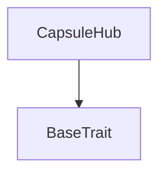

# Tact compilation report
Contract: CapsuleHub
BoC Size: 8107 bytes

## Structures (Structs and Messages)
Total structures: 28

### DataSize
TL-B: `_ cells:int257 bits:int257 refs:int257 = DataSize`
Signature: `DataSize{cells:int257,bits:int257,refs:int257}`

### SignedBundle
TL-B: `_ signature:fixed_bytes64 signedData:remainder<slice> = SignedBundle`
Signature: `SignedBundle{signature:fixed_bytes64,signedData:remainder<slice>}`

### StateInit
TL-B: `_ code:^cell data:^cell = StateInit`
Signature: `StateInit{code:^cell,data:^cell}`

### Context
TL-B: `_ bounceable:bool sender:address value:int257 raw:^slice = Context`
Signature: `Context{bounceable:bool,sender:address,value:int257,raw:^slice}`

### SendParameters
TL-B: `_ mode:int257 body:Maybe ^cell code:Maybe ^cell data:Maybe ^cell value:int257 to:address bounce:bool = SendParameters`
Signature: `SendParameters{mode:int257,body:Maybe ^cell,code:Maybe ^cell,data:Maybe ^cell,value:int257,to:address,bounce:bool}`

### MessageParameters
TL-B: `_ mode:int257 body:Maybe ^cell value:int257 to:address bounce:bool = MessageParameters`
Signature: `MessageParameters{mode:int257,body:Maybe ^cell,value:int257,to:address,bounce:bool}`

### DeployParameters
TL-B: `_ mode:int257 body:Maybe ^cell value:int257 bounce:bool init:StateInit{code:^cell,data:^cell} = DeployParameters`
Signature: `DeployParameters{mode:int257,body:Maybe ^cell,value:int257,bounce:bool,init:StateInit{code:^cell,data:^cell}}`

### StdAddress
TL-B: `_ workchain:int8 address:uint256 = StdAddress`
Signature: `StdAddress{workchain:int8,address:uint256}`

### VarAddress
TL-B: `_ workchain:int32 address:^slice = VarAddress`
Signature: `VarAddress{workchain:int32,address:^slice}`

### BasechainAddress
TL-B: `_ hash:Maybe int257 = BasechainAddress`
Signature: `BasechainAddress{hash:Maybe int257}`

### BindDeploymentManifest
TL-B: `bind_deployment_manifest#90e2e0cb deployment_manifest_hash:uint256 counterpart_address:address = BindDeploymentManifest`
Signature: `BindDeploymentManifest{deployment_manifest_hash:uint256,counterpart_address:address}`

### SealGenesis
TL-B: `seal_genesis#3a12d1ad deployment_manifest_hash:uint256 = SealGenesis`
Signature: `SealGenesis{deployment_manifest_hash:uint256}`

### FlushFees
TL-B: `flush_fees#7a861031 amount:uint128 = FlushFees`
Signature: `FlushFees{amount:uint128}`

### TopUpStorageReserve
TL-B: `top_up_storage_reserve#5331b880  = TopUpStorageReserve`
Signature: `TopUpStorageReserve{}`

### SweepExcessReserve
TL-B: `sweep_excess_reserve#53575052 amount:uint128 = SweepExcessReserve`
Signature: `SweepExcessReserve{amount:uint128}`

### DepositProtocolFee
TL-B: `deposit_protocol_fee#ff775609 amount:uint128 = DepositProtocolFee`
Signature: `DepositProtocolFee{amount:uint128}`

### PruneCapsuleEntry
TL-B: `prune_capsule_entry#4350524e kind:uint8 entry_id:uint64 publish_id:uint256 = PruneCapsuleEntry`
Signature: `PruneCapsuleEntry{kind:uint8,entry_id:uint64,publish_id:uint256}`

### PublishBatchToHub
TL-B: `publish_batch_to_hub#a4f862d1 bounce_id:uint64 bounce_tag:uint160 publish_id:uint256 publish_kind:uint8 part_count:uint8 protocol_fee_total:uint128 author_wallet:address parts:^cell marketing:Maybe ^cell = PublishBatchToHub`
Signature: `PublishBatchToHub{bounce_id:uint64,bounce_tag:uint160,publish_id:uint256,publish_kind:uint8,part_count:uint8,protocol_fee_total:uint128,author_wallet:address,parts:^cell,marketing:Maybe ^cell}`

### CapsuleHubBatchAck
TL-B: `capsule_hub_batch_ack#874e5771 publish_id:uint256 first_entry_id:uint64 part_count:uint8 batch_uid:uint256 = CapsuleHubBatchAck`
Signature: `CapsuleHubBatchAck{publish_id:uint256,first_entry_id:uint64,part_count:uint8,batch_uid:uint256}`

### CapsuleHubStateView
TL-B: `_ sealed:bool vault_bound:bool deployment_manifest_hash:int257 private_latest_id:int257 public_latest_id:int257 private_page_count:int257 public_page_count:int257 page_size:int257 index_storage_years:int257 index_retention_seconds:int257 accrued_plato_fee_ton:int257 fee_accumulator_address:address vault_address:address genesis_controller_address:address private_live_count:int257 public_live_count:int257 index_storage_reserve_ton:int257 protected_reserve_ton:int257 reserve_floor_ton:int257 reserve_buffer_numerator:int257 reserve_buffer_denominator:int257 = CapsuleHubStateView`
Signature: `CapsuleHubStateView{sealed:bool,vault_bound:bool,deployment_manifest_hash:int257,private_latest_id:int257,public_latest_id:int257,private_page_count:int257,public_page_count:int257,page_size:int257,index_storage_years:int257,index_retention_seconds:int257,accrued_plato_fee_ton:int257,fee_accumulator_address:address,vault_address:address,genesis_controller_address:address,private_live_count:int257,public_live_count:int257,index_storage_reserve_ton:int257,protected_reserve_ton:int257,reserve_floor_ton:int257,reserve_buffer_numerator:int257,reserve_buffer_denominator:int257}`

### CapsuleHubPageView
TL-B: `_ exists:bool page_id:int257 first_entry_id:int257 next_entry_id:int257 entry_count:int257 opened_at:int257 updated_at:int257 = CapsuleHubPageView`
Signature: `CapsuleHubPageView{exists:bool,page_id:int257,first_entry_id:int257,next_entry_id:int257,entry_count:int257,opened_at:int257,updated_at:int257}`

### PrivateCapsuleEntry
TL-B: `_ publish_id:uint256 created_at:uint32 body_hash:uint256 sender_prev_link:uint64 recipient_prev_link:uint64 header_0:^cell header_1:^cell = PrivateCapsuleEntry`
Signature: `PrivateCapsuleEntry{publish_id:uint256,created_at:uint32,body_hash:uint256,sender_prev_link:uint64,recipient_prev_link:uint64,header_0:^cell,header_1:^cell}`

### PublicCapsuleEntry
TL-B: `_ publish_id:uint256 created_at:uint32 author_wallet:address body_hash:uint256 header:^cell = PublicCapsuleEntry`
Signature: `PublicCapsuleEntry{publish_id:uint256,created_at:uint32,author_wallet:address,body_hash:uint256,header:^cell}`

### PrivateCapsuleEntryView
TL-B: `_ exists:bool entry_id:int257 sender_prev_link:int257 recipient_prev_link:int257 entry_uid:int257 publish_id:int257 author_wallet:address page_id:int257 page_offset:int257 created_at:int257 header_0_hash:int257 header_1_hash:int257 body_hash:int257 header_0:^cell header_1:^cell = PrivateCapsuleEntryView`
Signature: `PrivateCapsuleEntryView{exists:bool,entry_id:int257,sender_prev_link:int257,recipient_prev_link:int257,entry_uid:int257,publish_id:int257,author_wallet:address,page_id:int257,page_offset:int257,created_at:int257,header_0_hash:int257,header_1_hash:int257,body_hash:int257,header_0:^cell,header_1:^cell}`

### PrivateCapsuleKeyIndex
TL-B: `_ latest_entry_link:uint64 entry_count:uint64 = PrivateCapsuleKeyIndex`
Signature: `PrivateCapsuleKeyIndex{latest_entry_link:uint64,entry_count:uint64}`

### PrivateCapsuleKeyIndexView
TL-B: `_ exists:bool key_id:int257 latest_entry_id:int257 latest_entry_link:int257 entry_count:int257 = PrivateCapsuleKeyIndexView`
Signature: `PrivateCapsuleKeyIndexView{exists:bool,key_id:int257,latest_entry_id:int257,latest_entry_link:int257,entry_count:int257}`

### PublicCapsuleEntryView
TL-B: `_ exists:bool entry_id:int257 entry_uid:int257 publish_id:int257 author_wallet:address page_id:int257 page_offset:int257 created_at:int257 header_hash:int257 body_hash:int257 header:^cell = PublicCapsuleEntryView`
Signature: `PublicCapsuleEntryView{exists:bool,entry_id:int257,entry_uid:int257,publish_id:int257,author_wallet:address,page_id:int257,page_offset:int257,created_at:int257,header_hash:int257,body_hash:int257,header:^cell}`

### CapsuleHub$Data
TL-B: `_ fee_accumulator_address:address vault_address:address vault_bound:bool sealed:bool deployment_manifest_hash:uint256 genesis_controller_address:address private_latest_id:uint64 public_latest_id:uint64 private_live_count:uint64 public_live_count:uint64 accrued_plato_fee_ton:uint128 private_entries:dict<uint64, ^PrivateCapsuleEntry{publish_id:uint256,created_at:uint32,body_hash:uint256,sender_prev_link:uint64,recipient_prev_link:uint64,header_0:^cell,header_1:^cell}> public_entries:dict<uint64, ^PublicCapsuleEntry{publish_id:uint256,created_at:uint32,author_wallet:address,body_hash:uint256,header:^cell}> private_sender_index:dict<uint256, ^PrivateCapsuleKeyIndex{latest_entry_link:uint64,entry_count:uint64}> private_recipient_index:dict<uint256, ^PrivateCapsuleKeyIndex{latest_entry_link:uint64,entry_count:uint64}> = CapsuleHub`
Signature: `CapsuleHub{fee_accumulator_address:address,vault_address:address,vault_bound:bool,sealed:bool,deployment_manifest_hash:uint256,genesis_controller_address:address,private_latest_id:uint64,public_latest_id:uint64,private_live_count:uint64,public_live_count:uint64,accrued_plato_fee_ton:uint128,private_entries:dict<uint64, ^PrivateCapsuleEntry{publish_id:uint256,created_at:uint32,body_hash:uint256,sender_prev_link:uint64,recipient_prev_link:uint64,header_0:^cell,header_1:^cell}>,public_entries:dict<uint64, ^PublicCapsuleEntry{publish_id:uint256,created_at:uint32,author_wallet:address,body_hash:uint256,header:^cell}>,private_sender_index:dict<uint256, ^PrivateCapsuleKeyIndex{latest_entry_link:uint64,entry_count:uint64}>,private_recipient_index:dict<uint256, ^PrivateCapsuleKeyIndex{latest_entry_link:uint64,entry_count:uint64}>}`

## Get methods
Total get methods: 7

## get_private_entry
Argument: entryId

## get_private_sender_index
Argument: keyId

## get_private_recipient_index
Argument: keyId

## get_public_entry
Argument: entryId

## get_private_page
Argument: pageId

## get_public_page
Argument: pageId

## get_state
No arguments

## Exit codes
* 2: Stack underflow
* 3: Stack overflow
* 4: Integer overflow
* 5: Integer out of expected range
* 6: Invalid opcode
* 7: Type check error
* 8: Cell overflow
* 9: Cell underflow
* 10: Dictionary error
* 11: 'Unknown' error
* 12: Fatal error
* 13: Out of gas error
* 14: Virtualization error
* 32: Action list is invalid
* 33: Action list is too long
* 34: Action is invalid or not supported
* 35: Invalid source address in outbound message
* 36: Invalid destination address in outbound message
* 37: Not enough Toncoin
* 38: Not enough extra currencies
* 39: Outbound message does not fit into a cell after rewriting
* 40: Cannot process a message
* 41: Library reference is null
* 42: Library change action error
* 43: Exceeded maximum number of cells in the library or the maximum depth of the Merkle tree
* 50: Account state size exceeded limits
* 128: Null reference exception
* 129: Invalid serialization prefix
* 130: Invalid incoming message
* 131: Constraints error
* 132: Access denied
* 133: Contract stopped
* 134: Invalid argument
* 135: Code of a contract was not found
* 136: Invalid standard address
* 138: Not a basechain address

## Trait inheritance diagram

## Contract dependency diagram

