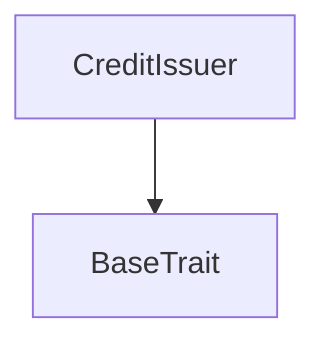
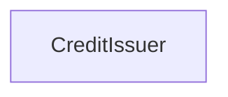

# Tact compilation report
Contract: CreditIssuer
BoC Size: 3073 bytes

## Structures (Structs and Messages)
Total structures: 29

### DataSize
TL-B: `_ cells:int257 bits:int257 refs:int257 = DataSize`
Signature: `DataSize{cells:int257,bits:int257,refs:int257}`

### SignedBundle
TL-B: `_ signature:fixed_bytes64 signedData:remainder<slice> = SignedBundle`
Signature: `SignedBundle{signature:fixed_bytes64,signedData:remainder<slice>}`

### StateInit
TL-B: `_ code:^cell data:^cell = StateInit`
Signature: `StateInit{code:^cell,data:^cell}`

### Context
TL-B: `_ bounceable:bool sender:address value:int257 raw:^slice = Context`
Signature: `Context{bounceable:bool,sender:address,value:int257,raw:^slice}`

### SendParameters
TL-B: `_ mode:int257 body:Maybe ^cell code:Maybe ^cell data:Maybe ^cell value:int257 to:address bounce:bool = SendParameters`
Signature: `SendParameters{mode:int257,body:Maybe ^cell,code:Maybe ^cell,data:Maybe ^cell,value:int257,to:address,bounce:bool}`

### MessageParameters
TL-B: `_ mode:int257 body:Maybe ^cell value:int257 to:address bounce:bool = MessageParameters`
Signature: `MessageParameters{mode:int257,body:Maybe ^cell,value:int257,to:address,bounce:bool}`

### DeployParameters
TL-B: `_ mode:int257 body:Maybe ^cell value:int257 bounce:bool init:StateInit{code:^cell,data:^cell} = DeployParameters`
Signature: `DeployParameters{mode:int257,body:Maybe ^cell,value:int257,bounce:bool,init:StateInit{code:^cell,data:^cell}}`

### StdAddress
TL-B: `_ workchain:int8 address:uint256 = StdAddress`
Signature: `StdAddress{workchain:int8,address:uint256}`

### VarAddress
TL-B: `_ workchain:int32 address:^slice = VarAddress`
Signature: `VarAddress{workchain:int32,address:^slice}`

### BasechainAddress
TL-B: `_ hash:Maybe int257 = BasechainAddress`
Signature: `BasechainAddress{hash:Maybe int257}`

### CreditUploadIssuerKey
TL-B: `credit_upload_issuer_key#43524431 slot:uint8 pubkey:uint256 = CreditUploadIssuerKey`
Signature: `CreditUploadIssuerKey{slot:uint8,pubkey:uint256}`

### CreditSetPrice
TL-B: `credit_set_price#43524432 credit_price:uint128 = CreditSetPrice`
Signature: `CreditSetPrice{credit_price:uint128}`

### CreditSealGenesis
TL-B: `credit_seal_genesis#3a12d1ad deployment_manifest_hash:uint256 = CreditSealGenesis`
Signature: `CreditSealGenesis{deployment_manifest_hash:uint256}`

### CreditReplaceIssuerKey
TL-B: `credit_replace_issuer_key#43524433 slot:uint8 new_pubkey:uint256 = CreditReplaceIssuerKey`
Signature: `CreditReplaceIssuerKey{slot:uint8,new_pubkey:uint256}`

### CreditRevokeIssuerKey
TL-B: `credit_revoke_issuer_key#43524434 slot:uint8 = CreditRevokeIssuerKey`
Signature: `CreditRevokeIssuerKey{slot:uint8}`

### CreditBuyCredits
TL-B: `credit_buy_credits#43524435 credits_k:uint16 redeem_pubkey:uint256 epoch:uint32 = CreditBuyCredits`
Signature: `CreditBuyCredits{credits_k:uint16,redeem_pubkey:uint256,epoch:uint32}`

### CreditBindHub
TL-B: `credit_bind_hub#43524436 capsule_hub_address:address = CreditBindHub`
Signature: `CreditBindHub{capsule_hub_address:address}`

### CreditTopUpStorageReserve
TL-B: `credit_top_up_storage_reserve#43524437  = CreditTopUpStorageReserve`
Signature: `CreditTopUpStorageReserve{}`

### CreditBindAirdropPool
TL-B: `credit_bind_airdrop_pool#43524439 airdrop_pool_address:address = CreditBindAirdropPool`
Signature: `CreditBindAirdropPool{airdrop_pool_address:address}`

### AirdropAccrue
TL-B: `airdrop_accrue#41445210 purchase_id:uint64 buyer:address credits_k:uint64 = AirdropAccrue`
Signature: `AirdropAccrue{purchase_id:uint64,buyer:address,credits_k:uint64}`

### CreditPurchaseRefund
TL-B: `credit_purchase_refund#43524438 purchase_id:uint64 credits_k:uint64 = CreditPurchaseRefund`
Signature: `CreditPurchaseRefund{purchase_id:uint64,credits_k:uint64}`

### FundAnonPool
TL-B: `fund_anon_pool#46414e50 credits_k:uint64 epoch:uint32 purchase_id:uint64 = FundAnonPool`
Signature: `FundAnonPool{credits_k:uint64,epoch:uint32,purchase_id:uint64}`

### FundAnonPoolAck
TL-B: `fund_anon_pool_ack#46414e41 credits_k:uint64 epoch:uint32 purchase_id:uint64 = FundAnonPoolAck`
Signature: `FundAnonPoolAck{credits_k:uint64,epoch:uint32,purchase_id:uint64}`

### IssuerSlot
TL-B: `_ pubkey:uint256 active:bool version:uint32 = IssuerSlot`
Signature: `IssuerSlot{pubkey:uint256,active:bool,version:uint32}`

### PendingPurchase
TL-B: `_ payer:address credits_k:uint64 refund_amount:uint128 = PendingPurchase`
Signature: `PendingPurchase{payer:address,credits_k:uint64,refund_amount:uint128}`

### PendingPurchaseView
TL-B: `_ exists:bool payer:address credits_k:int257 refund_amount:int257 = PendingPurchaseView`
Signature: `PendingPurchaseView{exists:bool,payer:address,credits_k:int257,refund_amount:int257}`

### CreditIssuerSlotView
TL-B: `_ exists:bool pubkey:int257 active:bool version:int257 = CreditIssuerSlotView`
Signature: `CreditIssuerSlotView{exists:bool,pubkey:int257,active:bool,version:int257}`

### CreditIssuerGlobalView
TL-B: `_ sealed:bool deployment_manifest_hash:int257 genesis_config_hash:int257 genesis_controller_address:address issuer_slot_count:int257 active_slot_count:int257 credit_price:int257 pool_collected:int257 credits_sold:int257 min_issuer_slots:int257 max_issuer_slots:int257 max_credits_per_buy:int257 base_storage_endowment:int257 hub_bound:bool capsule_hub_address:address prepaid_unit:int257 hub_fund_gas:int257 airdrop_pool_address:address airdrop_pool_bound:bool = CreditIssuerGlobalView`
Signature: `CreditIssuerGlobalView{sealed:bool,deployment_manifest_hash:int257,genesis_config_hash:int257,genesis_controller_address:address,issuer_slot_count:int257,active_slot_count:int257,credit_price:int257,pool_collected:int257,credits_sold:int257,min_issuer_slots:int257,max_issuer_slots:int257,max_credits_per_buy:int257,base_storage_endowment:int257,hub_bound:bool,capsule_hub_address:address,prepaid_unit:int257,hub_fund_gas:int257,airdrop_pool_address:address,airdrop_pool_bound:bool}`

### CreditIssuer$Data
TL-B: `_ sealed:bool genesis_controller_address:address deployment_manifest_hash:uint256 genesis_config_hash:uint256 issuer_slot_count:uint8 active_slot_count:uint8 issuer_slots:dict<int, ^IssuerSlot{pubkey:uint256,active:bool,version:uint32}> credit_price:uint128 pool_collected:uint128 credits_sold:uint64 capsule_hub_address:address hub_bound:bool pending_purchases:dict<int, ^PendingPurchase{payer:address,credits_k:uint64,refund_amount:uint128}> purchase_seq:uint64 airdrop_pool_address:address airdrop_pool_bound:bool = CreditIssuer`
Signature: `CreditIssuer{sealed:bool,genesis_controller_address:address,deployment_manifest_hash:uint256,genesis_config_hash:uint256,issuer_slot_count:uint8,active_slot_count:uint8,issuer_slots:dict<int, ^IssuerSlot{pubkey:uint256,active:bool,version:uint32}>,credit_price:uint128,pool_collected:uint128,credits_sold:uint64,capsule_hub_address:address,hub_bound:bool,pending_purchases:dict<int, ^PendingPurchase{payer:address,credits_k:uint64,refund_amount:uint128}>,purchase_seq:uint64,airdrop_pool_address:address,airdrop_pool_bound:bool}`

## Get methods
Total get methods: 3

## get_issuer_slot
Argument: slot

## get_pending_purchase
Argument: purchaseId

## get_global
No arguments

## Exit codes
* 2: Stack underflow
* 3: Stack overflow
* 4: Integer overflow
* 5: Integer out of expected range
* 6: Invalid opcode
* 7: Type check error
* 8: Cell overflow
* 9: Cell underflow
* 10: Dictionary error
* 11: 'Unknown' error
* 12: Fatal error
* 13: Out of gas error
* 14: Virtualization error
* 32: Action list is invalid
* 33: Action list is too long
* 34: Action is invalid or not supported
* 35: Invalid source address in outbound message
* 36: Invalid destination address in outbound message
* 37: Not enough Toncoin
* 38: Not enough extra currencies
* 39: Outbound message does not fit into a cell after rewriting
* 40: Cannot process a message
* 41: Library reference is null
* 42: Library change action error
* 43: Exceeded maximum number of cells in the library or the maximum depth of the Merkle tree
* 50: Account state size exceeded limits
* 128: Null reference exception
* 129: Invalid serialization prefix
* 130: Invalid incoming message
* 131: Constraints error
* 132: Access denied
* 133: Contract stopped
* 134: Invalid argument
* 135: Code of a contract was not found
* 136: Invalid standard address
* 138: Not a basechain address

## Trait inheritance diagram

## Contract dependency diagram

