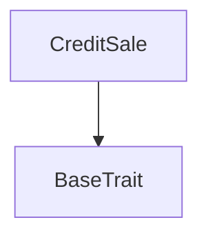

# Tact compilation report
Contract: CreditSale
BoC Size: 1320 bytes

## Structures (Structs and Messages)
Total structures: 21

### DataSize
TL-B: `_ cells:int257 bits:int257 refs:int257 = DataSize`
Signature: `DataSize{cells:int257,bits:int257,refs:int257}`

### SignedBundle
TL-B: `_ signature:fixed_bytes64 signedData:remainder<slice> = SignedBundle`
Signature: `SignedBundle{signature:fixed_bytes64,signedData:remainder<slice>}`

### StateInit
TL-B: `_ code:^cell data:^cell = StateInit`
Signature: `StateInit{code:^cell,data:^cell}`

### Context
TL-B: `_ bounceable:bool sender:address value:int257 raw:^slice = Context`
Signature: `Context{bounceable:bool,sender:address,value:int257,raw:^slice}`

### SendParameters
TL-B: `_ mode:int257 body:Maybe ^cell code:Maybe ^cell data:Maybe ^cell value:int257 to:address bounce:bool = SendParameters`
Signature: `SendParameters{mode:int257,body:Maybe ^cell,code:Maybe ^cell,data:Maybe ^cell,value:int257,to:address,bounce:bool}`

### MessageParameters
TL-B: `_ mode:int257 body:Maybe ^cell value:int257 to:address bounce:bool = MessageParameters`
Signature: `MessageParameters{mode:int257,body:Maybe ^cell,value:int257,to:address,bounce:bool}`

### DeployParameters
TL-B: `_ mode:int257 body:Maybe ^cell value:int257 bounce:bool init:StateInit{code:^cell,data:^cell} = DeployParameters`
Signature: `DeployParameters{mode:int257,body:Maybe ^cell,value:int257,bounce:bool,init:StateInit{code:^cell,data:^cell}}`

### StdAddress
TL-B: `_ workchain:int8 address:uint256 = StdAddress`
Signature: `StdAddress{workchain:int8,address:uint256}`

### VarAddress
TL-B: `_ workchain:int32 address:^slice = VarAddress`
Signature: `VarAddress{workchain:int32,address:^slice}`

### BasechainAddress
TL-B: `_ hash:Maybe int257 = BasechainAddress`
Signature: `BasechainAddress{hash:Maybe int257}`

### CsBindAirdropPool
TL-B: `cs_bind_airdrop_pool#43533031 airdrop_pool_address:address = CsBindAirdropPool`
Signature: `CsBindAirdropPool{airdrop_pool_address:address}`

### CsBindFeeReceiver
TL-B: `cs_bind_fee_receiver#43533032 fee_receiver_address:address = CsBindFeeReceiver`
Signature: `CsBindFeeReceiver{fee_receiver_address:address}`

### CsSetCreditFee
TL-B: `cs_set_credit_fee#43533033 credit_fee:uint128 = CsSetCreditFee`
Signature: `CsSetCreditFee{credit_fee:uint128}`

### CsSealGenesis
TL-B: `cs_seal_genesis#43533034 deployment_manifest_hash:uint256 = CsSealGenesis`
Signature: `CsSealGenesis{deployment_manifest_hash:uint256}`

### CsBuyCredits
TL-B: `cs_buy_credits#43533035 credits_k:uint16 redeem_pubkey:uint256 = CsBuyCredits`
Signature: `CsBuyCredits{credits_k:uint16,redeem_pubkey:uint256}`

### CsFlushFees
TL-B: `cs_flush_fees#43533036  = CsFlushFees`
Signature: `CsFlushFees{}`

### CsTopUpStorageReserve
TL-B: `cs_top_up_storage_reserve#43533037  = CsTopUpStorageReserve`
Signature: `CsTopUpStorageReserve{}`

### AirdropAccrue
TL-B: `airdrop_accrue#41445210 purchase_id:uint64 buyer:address credits_k:uint64 = AirdropAccrue`
Signature: `AirdropAccrue{purchase_id:uint64,buyer:address,credits_k:uint64}`

### DepositProtocolFee
TL-B: `deposit_protocol_fee#ff775609 amount:uint128 = DepositProtocolFee`
Signature: `DepositProtocolFee{amount:uint128}`

### CreditSaleView
TL-B: `_ sealed:bool genesis_controller_address:address deployment_manifest_hash:int257 airdrop_pool_address:address airdrop_pool_bound:bool fee_receiver_address:address fee_receiver_bound:bool credit_fee:int257 fees_collected:int257 credits_sold:int257 purchase_seq:int257 = CreditSaleView`
Signature: `CreditSaleView{sealed:bool,genesis_controller_address:address,deployment_manifest_hash:int257,airdrop_pool_address:address,airdrop_pool_bound:bool,fee_receiver_address:address,fee_receiver_bound:bool,credit_fee:int257,fees_collected:int257,credits_sold:int257,purchase_seq:int257}`

### CreditSale$Data
TL-B: `_ sealed:bool genesis_controller_address:address deployment_manifest_hash:uint256 airdrop_pool_address:address airdrop_pool_bound:bool fee_receiver_address:address fee_receiver_bound:bool credit_fee:uint128 fees_collected:uint128 credits_sold:uint64 purchase_seq:uint64 = CreditSale`
Signature: `CreditSale{sealed:bool,genesis_controller_address:address,deployment_manifest_hash:uint256,airdrop_pool_address:address,airdrop_pool_bound:bool,fee_receiver_address:address,fee_receiver_bound:bool,credit_fee:uint128,fees_collected:uint128,credits_sold:uint64,purchase_seq:uint64}`

## Get methods
Total get methods: 1

## get_global
No arguments

## Exit codes
* 2: Stack underflow
* 3: Stack overflow
* 4: Integer overflow
* 5: Integer out of expected range
* 6: Invalid opcode
* 7: Type check error
* 8: Cell overflow
* 9: Cell underflow
* 10: Dictionary error
* 11: 'Unknown' error
* 12: Fatal error
* 13: Out of gas error
* 14: Virtualization error
* 32: Action list is invalid
* 33: Action list is too long
* 34: Action is invalid or not supported
* 35: Invalid source address in outbound message
* 36: Invalid destination address in outbound message
* 37: Not enough Toncoin
* 38: Not enough extra currencies
* 39: Outbound message does not fit into a cell after rewriting
* 40: Cannot process a message
* 41: Library reference is null
* 42: Library change action error
* 43: Exceeded maximum number of cells in the library or the maximum depth of the Merkle tree
* 50: Account state size exceeded limits
* 128: Null reference exception
* 129: Invalid serialization prefix
* 130: Invalid incoming message
* 131: Constraints error
* 132: Access denied
* 133: Contract stopped
* 134: Invalid argument
* 135: Code of a contract was not found
* 136: Invalid standard address
* 138: Not a basechain address

## Trait inheritance diagram

## Contract dependency diagram

