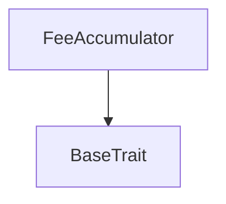
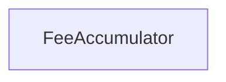

# Tact compilation report
Contract: FeeAccumulator
BoC Size: 2893 bytes

## Structures (Structs and Messages)
Total structures: 30

### DataSize
TL-B: `_ cells:int257 bits:int257 refs:int257 = DataSize`
Signature: `DataSize{cells:int257,bits:int257,refs:int257}`

### SignedBundle
TL-B: `_ signature:fixed_bytes64 signedData:remainder<slice> = SignedBundle`
Signature: `SignedBundle{signature:fixed_bytes64,signedData:remainder<slice>}`

### StateInit
TL-B: `_ code:^cell data:^cell = StateInit`
Signature: `StateInit{code:^cell,data:^cell}`

### Context
TL-B: `_ bounceable:bool sender:address value:int257 raw:^slice = Context`
Signature: `Context{bounceable:bool,sender:address,value:int257,raw:^slice}`

### SendParameters
TL-B: `_ mode:int257 body:Maybe ^cell code:Maybe ^cell data:Maybe ^cell value:int257 to:address bounce:bool = SendParameters`
Signature: `SendParameters{mode:int257,body:Maybe ^cell,code:Maybe ^cell,data:Maybe ^cell,value:int257,to:address,bounce:bool}`

### MessageParameters
TL-B: `_ mode:int257 body:Maybe ^cell value:int257 to:address bounce:bool = MessageParameters`
Signature: `MessageParameters{mode:int257,body:Maybe ^cell,value:int257,to:address,bounce:bool}`

### DeployParameters
TL-B: `_ mode:int257 body:Maybe ^cell value:int257 bounce:bool init:StateInit{code:^cell,data:^cell} = DeployParameters`
Signature: `DeployParameters{mode:int257,body:Maybe ^cell,value:int257,bounce:bool,init:StateInit{code:^cell,data:^cell}}`

### StdAddress
TL-B: `_ workchain:int8 address:uint256 = StdAddress`
Signature: `StdAddress{workchain:int8,address:uint256}`

### VarAddress
TL-B: `_ workchain:int32 address:^slice = VarAddress`
Signature: `VarAddress{workchain:int32,address:^slice}`

### BasechainAddress
TL-B: `_ hash:Maybe int257 = BasechainAddress`
Signature: `BasechainAddress{hash:Maybe int257}`

### DepositProtocolFee
TL-B: `deposit_protocol_fee#ff775609 amount:uint128 = DepositProtocolFee`
Signature: `DepositProtocolFee{amount:uint128}`

### SplitAccumulated
TL-B: `split_accumulated#7b24ea03  = SplitAccumulated`
Signature: `SplitAccumulated{}`

### EnableBuybackSplit
TL-B: `enable_buyback_split#8d8f2c18  = EnableBuybackSplit`
Signature: `EnableBuybackSplit{}`

### FlushTreasuryDue
TL-B: `flush_treasury_due#ddab4641 amount:uint128 = FlushTreasuryDue`
Signature: `FlushTreasuryDue{amount:uint128}`

### FlushBuybackDue
TL-B: `flush_buyback_due#b3d2c52d amount:uint128 = FlushBuybackDue`
Signature: `FlushBuybackDue{amount:uint128}`

### TopUpStorageReserve
TL-B: `top_up_storage_reserve#87a2d2c7  = TopUpStorageReserve`
Signature: `TopUpStorageReserve{}`

### SweepUnaccounted
TL-B: `sweep_unaccounted#5357554e  = SweepUnaccounted`
Signature: `SweepUnaccounted{}`

### AcceptBurnReserve
TL-B: `accept_burn_reserve#594ba505 amount:uint128 = AcceptBurnReserve`
Signature: `AcceptBurnReserve{amount:uint128}`

### DepositCapsuleFee
TL-B: `deposit_capsule_fee#52535046 amount:uint128 lane:uint8 init_arg0:int257 init_arg1:int257 publisher:address = DepositCapsuleFee`
Signature: `DepositCapsuleFee{amount:uint128,lane:uint8,init_arg0:int257,init_arg1:int257,publisher:address}`

### TicketCredit
TL-B: `ticket_credit#41544331  = TicketCredit`
Signature: `TicketCredit{}`

### TicketRedeem
TL-B: `ticket_redeem#41544333 credits_k:uint32 owner:address = TicketRedeem`
Signature: `TicketRedeem{credits_k:uint32,owner:address}`

### TicketRedeemAck
TL-B: `ticket_redeem_ack#41544334 credits_k:uint32 = TicketRedeemAck`
Signature: `TicketRedeemAck{credits_k:uint32}`

### AirdropAccrue
TL-B: `airdrop_accrue#41445210 purchase_id:uint64 buyer:address credits_k:uint32 = AirdropAccrue`
Signature: `AirdropAccrue{purchase_id:uint64,buyer:address,credits_k:uint32}`

### BindShardCode
TL-B: `bind_shard_code#fa110001 shard_code:^cell = BindShardCode`
Signature: `BindShardCode{shard_code:^cell}`

### BindTicketCode
TL-B: `bind_ticket_code#fa110002 ticket_code:^cell = BindTicketCode`
Signature: `BindTicketCode{ticket_code:^cell}`

### BindIntroShardCode
TL-B: `bind_intro_shard_code#fa110004 intro_shard_code:^cell = BindIntroShardCode`
Signature: `BindIntroShardCode{intro_shard_code:^cell}`

### BindAirdropPool
TL-B: `bind_airdrop_pool#fa110003 airdrop_pool_address:address = BindAirdropPool`
Signature: `BindAirdropPool{airdrop_pool_address:address}`

### BindPublicShardCode
TL-B: `bind_public_shard_code#fa110005 public_shard_code:^cell = BindPublicShardCode`
Signature: `BindPublicShardCode{public_shard_code:^cell}`

### FeeAccumulatorStateView
TL-B: `_ accumulated_ton:int257 treasury_due_ton:int257 buyback_due_ton:int257 buyback_split_enabled:bool treasury_receiver_address:address buyback_burn_address:address storage_reserve_ton:int257 = FeeAccumulatorStateView`
Signature: `FeeAccumulatorStateView{accumulated_ton:int257,treasury_due_ton:int257,buyback_due_ton:int257,buyback_split_enabled:bool,treasury_receiver_address:address,buyback_burn_address:address,storage_reserve_ton:int257}`

### FeeAccumulator$Data
TL-B: `_ treasury_receiver_address:address buyback_burn_address:address accumulated_ton:uint128 treasury_due_ton:uint128 buyback_due_ton:uint128 buyback_split_enabled:bool storage_reserve_ton:coins shard_code:Maybe ^cell intro_shard_code:Maybe ^cell ticket_code:Maybe ^cell airdrop_pool_address:address public_shard_code:Maybe ^cell accrual_seq:uint64 = FeeAccumulator`
Signature: `FeeAccumulator{treasury_receiver_address:address,buyback_burn_address:address,accumulated_ton:uint128,treasury_due_ton:uint128,buyback_due_ton:uint128,buyback_split_enabled:bool,storage_reserve_ton:coins,shard_code:Maybe ^cell,intro_shard_code:Maybe ^cell,ticket_code:Maybe ^cell,airdrop_pool_address:address,public_shard_code:Maybe ^cell,accrual_seq:uint64}`

## Get methods
Total get methods: 1

## get_state
No arguments

## Exit codes
* 2: Stack underflow
* 3: Stack overflow
* 4: Integer overflow
* 5: Integer out of expected range
* 6: Invalid opcode
* 7: Type check error
* 8: Cell overflow
* 9: Cell underflow
* 10: Dictionary error
* 11: 'Unknown' error
* 12: Fatal error
* 13: Out of gas error
* 14: Virtualization error
* 32: Action list is invalid
* 33: Action list is too long
* 34: Action is invalid or not supported
* 35: Invalid source address in outbound message
* 36: Invalid destination address in outbound message
* 37: Not enough Toncoin
* 38: Not enough extra currencies
* 39: Outbound message does not fit into a cell after rewriting
* 40: Cannot process a message
* 41: Library reference is null
* 42: Library change action error
* 43: Exceeded maximum number of cells in the library or the maximum depth of the Merkle tree
* 50: Account state size exceeded limits
* 128: Null reference exception
* 129: Invalid serialization prefix
* 130: Invalid incoming message
* 131: Constraints error
* 132: Access denied
* 133: Contract stopped
* 134: Invalid argument
* 135: Code of a contract was not found
* 136: Invalid standard address
* 138: Not a basechain address

## Trait inheritance diagram

## Contract dependency diagram

