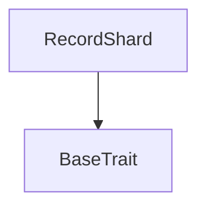
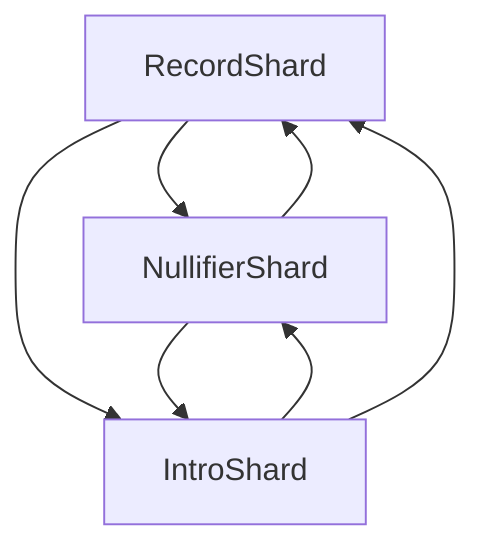

# Tact compilation report
Contract: RecordShard
BoC Size: 841 bytes

## Structures (Structs and Messages)
Total structures: 25

### DataSize
TL-B: `_ cells:int257 bits:int257 refs:int257 = DataSize`
Signature: `DataSize{cells:int257,bits:int257,refs:int257}`

### SignedBundle
TL-B: `_ signature:fixed_bytes64 signedData:remainder<slice> = SignedBundle`
Signature: `SignedBundle{signature:fixed_bytes64,signedData:remainder<slice>}`

### StateInit
TL-B: `_ code:^cell data:^cell = StateInit`
Signature: `StateInit{code:^cell,data:^cell}`

### Context
TL-B: `_ bounceable:bool sender:address value:int257 raw:^slice = Context`
Signature: `Context{bounceable:bool,sender:address,value:int257,raw:^slice}`

### SendParameters
TL-B: `_ mode:int257 body:Maybe ^cell code:Maybe ^cell data:Maybe ^cell value:int257 to:address bounce:bool = SendParameters`
Signature: `SendParameters{mode:int257,body:Maybe ^cell,code:Maybe ^cell,data:Maybe ^cell,value:int257,to:address,bounce:bool}`

### MessageParameters
TL-B: `_ mode:int257 body:Maybe ^cell value:int257 to:address bounce:bool = MessageParameters`
Signature: `MessageParameters{mode:int257,body:Maybe ^cell,value:int257,to:address,bounce:bool}`

### DeployParameters
TL-B: `_ mode:int257 body:Maybe ^cell value:int257 bounce:bool init:StateInit{code:^cell,data:^cell} = DeployParameters`
Signature: `DeployParameters{mode:int257,body:Maybe ^cell,value:int257,bounce:bool,init:StateInit{code:^cell,data:^cell}}`

### StdAddress
TL-B: `_ workchain:int8 address:uint256 = StdAddress`
Signature: `StdAddress{workchain:int8,address:uint256}`

### VarAddress
TL-B: `_ workchain:int32 address:^slice = VarAddress`
Signature: `VarAddress{workchain:int32,address:^slice}`

### BasechainAddress
TL-B: `_ hash:Maybe int257 = BasechainAddress`
Signature: `BasechainAddress{hash:Maybe int257}`

### NullifierSpend
TL-B: `nullifier_spend#4e535032 spend_pubkey:uint256 epoch:uint32 nonce:uint64 subkey_pubkey:uint256 valid_from:uint32 valid_to:uint32 root_idx_a:uint8 root_idx_b:uint8 kind:uint8 bucket_key:uint256 frame_commit:uint256 intro_bucket:uint32 intro_r:uint256 intro_view_tag:uint16 issuer_sig:^cell cert_sig_a:^cell cert_sig_b:^cell = NullifierSpend`
Signature: `NullifierSpend{spend_pubkey:uint256,epoch:uint32,nonce:uint64,subkey_pubkey:uint256,valid_from:uint32,valid_to:uint32,root_idx_a:uint8,root_idx_b:uint8,kind:uint8,bucket_key:uint256,frame_commit:uint256,intro_bucket:uint32,intro_r:uint256,intro_view_tag:uint16,issuer_sig:^cell,cert_sig_a:^cell,cert_sig_b:^cell}`

### NullifierShardView
TL-B: `_ epoch:int257 lane:int257 spent_count:int257 lane_count:int257 safe_cap:int257 root_threshold:int257 max_cert_epochs:int257 = NullifierShardView`
Signature: `NullifierShardView{epoch:int257,lane:int257,spent_count:int257,lane_count:int257,safe_cap:int257,root_threshold:int257,max_cert_epochs:int257}`

### NullifierShard$Data
TL-B: `_ epoch:uint32 lane:uint32 spent:dict<int, bool> spent_count:uint32 = NullifierShard`
Signature: `NullifierShard{epoch:uint32,lane:uint32,spent:dict<int, bool>,spent_count:uint32}`

### RecordStore
TL-B: `record_store#52535031 serial:uint256 frame_commit:uint256 = RecordStore`
Signature: `RecordStore{serial:uint256,frame_commit:uint256}`

### EvictRecords
TL-B: `evict_records#52535032 max_count:uint16 = EvictRecords`
Signature: `EvictRecords{max_count:uint16}`

### RecordEntry
TL-B: `_ frame_commit:int257 created_at:int257 = RecordEntry`
Signature: `RecordEntry{frame_commit:int257,created_at:int257}`

### CapsuleRecordView
TL-B: `_ exists:bool frame_commit:int257 = CapsuleRecordView`
Signature: `CapsuleRecordView{exists:bool,frame_commit:int257}`

### RecordShardView
TL-B: `_ bucket_key:int257 epoch:int257 record_count:int257 live_count:int257 evict_cursor:int257 lane_count:int257 safe_cap:int257 retention:int257 = RecordShardView`
Signature: `RecordShardView{bucket_key:int257,epoch:int257,record_count:int257,live_count:int257,evict_cursor:int257,lane_count:int257,safe_cap:int257,retention:int257}`

### RecordShard$Data
TL-B: `_ bucket_key:uint256 epoch:uint32 records:dict<int, ^RecordEntry{frame_commit:int257,created_at:int257}> record_count:uint32 live_count:uint32 evict_cursor:uint32 = RecordShard`
Signature: `RecordShard{bucket_key:uint256,epoch:uint32,records:dict<int, ^RecordEntry{frame_commit:int257,created_at:int257}>,record_count:uint32,live_count:uint32,evict_cursor:uint32}`

### IntroStore
TL-B: `intro_store#49535032 serial:uint256 r:uint256 view_tag:uint16 body_commit:uint256 = IntroStore`
Signature: `IntroStore{serial:uint256,r:uint256,view_tag:uint16,body_commit:uint256}`

### EvictIntros
TL-B: `evict_intros#49535033 max_count:uint16 = EvictIntros`
Signature: `EvictIntros{max_count:uint16}`

### IntroEntry
TL-B: `_ r:int257 view_tag:int257 body_commit:int257 created_at:int257 = IntroEntry`
Signature: `IntroEntry{r:int257,view_tag:int257,body_commit:int257,created_at:int257}`

### IntroEntryView
TL-B: `_ exists:bool r:int257 view_tag:int257 body_commit:int257 created_at:int257 = IntroEntryView`
Signature: `IntroEntryView{exists:bool,r:int257,view_tag:int257,body_commit:int257,created_at:int257}`

### IntroShardView
TL-B: `_ epoch:int257 bucket:int257 live_count:int257 next_id:int257 evict_cursor:int257 retention:int257 safe_cap:int257 = IntroShardView`
Signature: `IntroShardView{epoch:int257,bucket:int257,live_count:int257,next_id:int257,evict_cursor:int257,retention:int257,safe_cap:int257}`

### IntroShard$Data
TL-B: `_ epoch:uint32 bucket:uint32 intros:dict<int, ^IntroEntry{r:int257,view_tag:int257,body_commit:int257,created_at:int257}> next_id:uint32 live_count:uint32 evict_cursor:uint32 = IntroShard`
Signature: `IntroShard{epoch:uint32,bucket:uint32,intros:dict<int, ^IntroEntry{r:int257,view_tag:int257,body_commit:int257,created_at:int257}>,next_id:uint32,live_count:uint32,evict_cursor:uint32}`

## Get methods
Total get methods: 2

## get_record
Argument: entry_id

## get_view
No arguments

## Exit codes
* 2: Stack underflow
* 3: Stack overflow
* 4: Integer overflow
* 5: Integer out of expected range
* 6: Invalid opcode
* 7: Type check error
* 8: Cell overflow
* 9: Cell underflow
* 10: Dictionary error
* 11: 'Unknown' error
* 12: Fatal error
* 13: Out of gas error
* 14: Virtualization error
* 32: Action list is invalid
* 33: Action list is too long
* 34: Action is invalid or not supported
* 35: Invalid source address in outbound message
* 36: Invalid destination address in outbound message
* 37: Not enough Toncoin
* 38: Not enough extra currencies
* 39: Outbound message does not fit into a cell after rewriting
* 40: Cannot process a message
* 41: Library reference is null
* 42: Library change action error
* 43: Exceeded maximum number of cells in the library or the maximum depth of the Merkle tree
* 50: Account state size exceeded limits
* 128: Null reference exception
* 129: Invalid serialization prefix
* 130: Invalid incoming message
* 131: Constraints error
* 132: Access denied
* 133: Contract stopped
* 134: Invalid argument
* 135: Code of a contract was not found
* 136: Invalid standard address
* 138: Not a basechain address

## Trait inheritance diagram

## Contract dependency diagram

