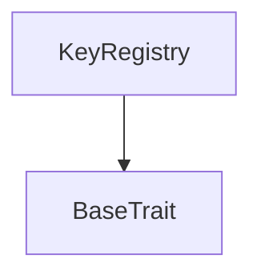

# Tact compilation report
Contract: KeyRegistry
BoC Size: 3052 bytes

## Structures (Structs and Messages)
Total structures: 21

### DataSize
TL-B: `_ cells:int257 bits:int257 refs:int257 = DataSize`
Signature: `DataSize{cells:int257,bits:int257,refs:int257}`

### SignedBundle
TL-B: `_ signature:fixed_bytes64 signedData:remainder<slice> = SignedBundle`
Signature: `SignedBundle{signature:fixed_bytes64,signedData:remainder<slice>}`

### StateInit
TL-B: `_ code:^cell data:^cell = StateInit`
Signature: `StateInit{code:^cell,data:^cell}`

### Context
TL-B: `_ bounceable:bool sender:address value:int257 raw:^slice = Context`
Signature: `Context{bounceable:bool,sender:address,value:int257,raw:^slice}`

### SendParameters
TL-B: `_ mode:int257 body:Maybe ^cell code:Maybe ^cell data:Maybe ^cell value:int257 to:address bounce:bool = SendParameters`
Signature: `SendParameters{mode:int257,body:Maybe ^cell,code:Maybe ^cell,data:Maybe ^cell,value:int257,to:address,bounce:bool}`

### MessageParameters
TL-B: `_ mode:int257 body:Maybe ^cell value:int257 to:address bounce:bool = MessageParameters`
Signature: `MessageParameters{mode:int257,body:Maybe ^cell,value:int257,to:address,bounce:bool}`

### DeployParameters
TL-B: `_ mode:int257 body:Maybe ^cell value:int257 bounce:bool init:StateInit{code:^cell,data:^cell} = DeployParameters`
Signature: `DeployParameters{mode:int257,body:Maybe ^cell,value:int257,bounce:bool,init:StateInit{code:^cell,data:^cell}}`

### StdAddress
TL-B: `_ workchain:int8 address:uint256 = StdAddress`
Signature: `StdAddress{workchain:int8,address:uint256}`

### VarAddress
TL-B: `_ workchain:int32 address:^slice = VarAddress`
Signature: `VarAddress{workchain:int32,address:^slice}`

### BasechainAddress
TL-B: `_ hash:Maybe int257 = BasechainAddress`
Signature: `BasechainAddress{hash:Maybe int257}`

### KeyRegRegisterMessagingKeys
TL-B: `key_reg_register_messaging_keys#4b524731 enc_pubkey:uint256 sign_pubkey:uint256 scan_pubkey:uint256 auth_pubkey:uint256 pq_kem_pubkey_hash:uint256 pq_kem_pubkey_len:uint16 pq_kem_pubkey:^cell crypto_suite_mask:uint16 = KeyRegRegisterMessagingKeys`
Signature: `KeyRegRegisterMessagingKeys{enc_pubkey:uint256,sign_pubkey:uint256,scan_pubkey:uint256,auth_pubkey:uint256,pq_kem_pubkey_hash:uint256,pq_kem_pubkey_len:uint16,pq_kem_pubkey:^cell,crypto_suite_mask:uint16}`

### KeyRegReplaceMessagingKeys
TL-B: `key_reg_replace_messaging_keys#4b524732 owner_wallet:address signature:fixed_bytes64 signed_payload:^cell envelope_padding:remainder<slice> = KeyRegReplaceMessagingKeys`
Signature: `KeyRegReplaceMessagingKeys{owner_wallet:address,signature:fixed_bytes64,signed_payload:^cell,envelope_padding:remainder<slice>}`

### KeyRegBindController
TL-B: `key_reg_bind_controller#4b524733 deployment_manifest_hash:uint256 = KeyRegBindController`
Signature: `KeyRegBindController{deployment_manifest_hash:uint256}`

### KeyRegSealGenesis
TL-B: `key_reg_seal_genesis#3a12d1ad deployment_manifest_hash:uint256 = KeyRegSealGenesis`
Signature: `KeyRegSealGenesis{deployment_manifest_hash:uint256}`

### KeyRegTopUpStorageReserve
TL-B: `key_reg_top_up_storage_reserve#4b524734  = KeyRegTopUpStorageReserve`
Signature: `KeyRegTopUpStorageReserve{}`

### KeyAccount
TL-B: `_ owner_wallet:address current_key_id:uint256 auth_pubkey:uint256 key_generation:uint32 rotation_nonce:uint64 registered_at:uint64 = KeyAccount`
Signature: `KeyAccount{owner_wallet:address,current_key_id:uint256,auth_pubkey:uint256,key_generation:uint32,rotation_nonce:uint64,registered_at:uint64}`

### KeyRecord
TL-B: `_ owner_wallet:address key_generation:uint32 enc_pubkey:uint256 sign_pubkey:uint256 scan_pubkey:uint256 pq_kem_pubkey_hash:uint256 pq_kem_pubkey_len:uint16 pq_kem_pubkey:^cell crypto_suite_mask:uint16 created_at:uint64 created_lt:uint64 revoked_at:uint64 revoked_lt:uint64 = KeyRecord`
Signature: `KeyRecord{owner_wallet:address,key_generation:uint32,enc_pubkey:uint256,sign_pubkey:uint256,scan_pubkey:uint256,pq_kem_pubkey_hash:uint256,pq_kem_pubkey_len:uint16,pq_kem_pubkey:^cell,crypto_suite_mask:uint16,created_at:uint64,created_lt:uint64,revoked_at:uint64,revoked_lt:uint64}`

### KeyRegKeyRecordView
TL-B: `_ exists:bool owner_wallet:address key_generation:int257 enc_pubkey:int257 sign_pubkey:int257 scan_pubkey:int257 pq_kem_pubkey_hash:int257 pq_kem_pubkey_len:int257 pq_kem_pubkey:^cell crypto_suite_mask:int257 created_at:int257 created_lt:int257 revoked_at:int257 revoked_lt:int257 = KeyRegKeyRecordView`
Signature: `KeyRegKeyRecordView{exists:bool,owner_wallet:address,key_generation:int257,enc_pubkey:int257,sign_pubkey:int257,scan_pubkey:int257,pq_kem_pubkey_hash:int257,pq_kem_pubkey_len:int257,pq_kem_pubkey:^cell,crypto_suite_mask:int257,created_at:int257,created_lt:int257,revoked_at:int257,revoked_lt:int257}`

### KeyRegAccountView
TL-B: `_ exists:bool owner_wallet:address current_key_id:int257 key_generation:int257 rotation_nonce:int257 registered_at:int257 = KeyRegAccountView`
Signature: `KeyRegAccountView{exists:bool,owner_wallet:address,current_key_id:int257,key_generation:int257,rotation_nonce:int257,registered_at:int257}`

### KeyRegGlobalView
TL-B: `_ sealed:bool deployment_manifest_hash:int257 genesis_config_hash:int257 genesis_controller_address:address account_count:int257 key_record_count:int257 key_record_storage_endowment:int257 account_storage_endowment:int257 base_storage_endowment:int257 = KeyRegGlobalView`
Signature: `KeyRegGlobalView{sealed:bool,deployment_manifest_hash:int257,genesis_config_hash:int257,genesis_controller_address:address,account_count:int257,key_record_count:int257,key_record_storage_endowment:int257,account_storage_endowment:int257,base_storage_endowment:int257}`

### KeyRegistry$Data
TL-B: `_ sealed:bool genesis_controller_address:address deployment_manifest_hash:uint256 genesis_config_hash:uint256 account_count:uint64 key_record_count:uint64 accounts:dict<int, ^KeyAccount{owner_wallet:address,current_key_id:uint256,auth_pubkey:uint256,key_generation:uint32,rotation_nonce:uint64,registered_at:uint64}> key_records:dict<int, ^KeyRecord{owner_wallet:address,key_generation:uint32,enc_pubkey:uint256,sign_pubkey:uint256,scan_pubkey:uint256,pq_kem_pubkey_hash:uint256,pq_kem_pubkey_len:uint16,pq_kem_pubkey:^cell,crypto_suite_mask:uint16,created_at:uint64,created_lt:uint64,revoked_at:uint64,revoked_lt:uint64}> = KeyRegistry`
Signature: `KeyRegistry{sealed:bool,genesis_controller_address:address,deployment_manifest_hash:uint256,genesis_config_hash:uint256,account_count:uint64,key_record_count:uint64,accounts:dict<int, ^KeyAccount{owner_wallet:address,current_key_id:uint256,auth_pubkey:uint256,key_generation:uint32,rotation_nonce:uint64,registered_at:uint64}>,key_records:dict<int, ^KeyRecord{owner_wallet:address,key_generation:uint32,enc_pubkey:uint256,sign_pubkey:uint256,scan_pubkey:uint256,pq_kem_pubkey_hash:uint256,pq_kem_pubkey_len:uint16,pq_kem_pubkey:^cell,crypto_suite_mask:uint16,created_at:uint64,created_lt:uint64,revoked_at:uint64,revoked_lt:uint64}>}`

## Get methods
Total get methods: 4

## get_key_record
Argument: keyId

## get_account
Argument: owner_wallet

## get_current_key_record
Argument: owner_wallet

## get_global
No arguments

## Exit codes
* 2: Stack underflow
* 3: Stack overflow
* 4: Integer overflow
* 5: Integer out of expected range
* 6: Invalid opcode
* 7: Type check error
* 8: Cell overflow
* 9: Cell underflow
* 10: Dictionary error
* 11: 'Unknown' error
* 12: Fatal error
* 13: Out of gas error
* 14: Virtualization error
* 32: Action list is invalid
* 33: Action list is too long
* 34: Action is invalid or not supported
* 35: Invalid source address in outbound message
* 36: Invalid destination address in outbound message
* 37: Not enough Toncoin
* 38: Not enough extra currencies
* 39: Outbound message does not fit into a cell after rewriting
* 40: Cannot process a message
* 41: Library reference is null
* 42: Library change action error
* 43: Exceeded maximum number of cells in the library or the maximum depth of the Merkle tree
* 50: Account state size exceeded limits
* 128: Null reference exception
* 129: Invalid serialization prefix
* 130: Invalid incoming message
* 131: Constraints error
* 132: Access denied
* 133: Contract stopped
* 134: Invalid argument
* 135: Code of a contract was not found
* 136: Invalid standard address
* 138: Not a basechain address

## Trait inheritance diagram

## Contract dependency diagram

