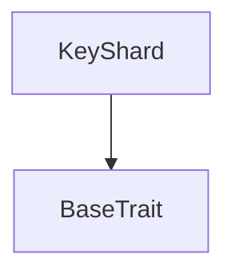
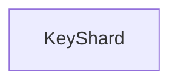

# Tact compilation report
Contract: KeyShard
BoC Size: 3307 bytes

## Structures (Structs and Messages)
Total structures: 19

### DataSize
TL-B: `_ cells:int257 bits:int257 refs:int257 = DataSize`
Signature: `DataSize{cells:int257,bits:int257,refs:int257}`

### SignedBundle
TL-B: `_ signature:fixed_bytes64 signedData:remainder<slice> = SignedBundle`
Signature: `SignedBundle{signature:fixed_bytes64,signedData:remainder<slice>}`

### StateInit
TL-B: `_ code:^cell data:^cell = StateInit`
Signature: `StateInit{code:^cell,data:^cell}`

### Context
TL-B: `_ bounceable:bool sender:address value:int257 raw:^slice = Context`
Signature: `Context{bounceable:bool,sender:address,value:int257,raw:^slice}`

### SendParameters
TL-B: `_ mode:int257 body:Maybe ^cell code:Maybe ^cell data:Maybe ^cell value:int257 to:address bounce:bool = SendParameters`
Signature: `SendParameters{mode:int257,body:Maybe ^cell,code:Maybe ^cell,data:Maybe ^cell,value:int257,to:address,bounce:bool}`

### MessageParameters
TL-B: `_ mode:int257 body:Maybe ^cell value:int257 to:address bounce:bool = MessageParameters`
Signature: `MessageParameters{mode:int257,body:Maybe ^cell,value:int257,to:address,bounce:bool}`

### DeployParameters
TL-B: `_ mode:int257 body:Maybe ^cell value:int257 bounce:bool init:StateInit{code:^cell,data:^cell} = DeployParameters`
Signature: `DeployParameters{mode:int257,body:Maybe ^cell,value:int257,bounce:bool,init:StateInit{code:^cell,data:^cell}}`

### StdAddress
TL-B: `_ workchain:int8 address:uint256 = StdAddress`
Signature: `StdAddress{workchain:int8,address:uint256}`

### VarAddress
TL-B: `_ workchain:int32 address:^slice = VarAddress`
Signature: `VarAddress{workchain:int32,address:^slice}`

### BasechainAddress
TL-B: `_ hash:Maybe int257 = BasechainAddress`
Signature: `BasechainAddress{hash:Maybe int257}`

### KeyShardRegisterKeys
TL-B: `key_shard_register_keys#4b534731 enc_pubkey:uint256 sign_pubkey:uint256 scan_pubkey:uint256 auth_pubkey:uint256 pq_kem_pubkey_hash:uint256 pq_kem_pubkey_len:uint16 pq_kem_pubkey:^cell crypto_suite_mask:uint16 = KeyShardRegisterKeys`
Signature: `KeyShardRegisterKeys{enc_pubkey:uint256,sign_pubkey:uint256,scan_pubkey:uint256,auth_pubkey:uint256,pq_kem_pubkey_hash:uint256,pq_kem_pubkey_len:uint16,pq_kem_pubkey:^cell,crypto_suite_mask:uint16}`

### KeyShardReplaceKeys
TL-B: `key_shard_replace_keys#4b534732 signature:fixed_bytes64 signed_payload:^cell envelope_padding:remainder<slice> = KeyShardReplaceKeys`
Signature: `KeyShardReplaceKeys{signature:fixed_bytes64,signed_payload:^cell,envelope_padding:remainder<slice>}`

### KeyShardTopUpStorageReserve
TL-B: `key_shard_top_up_storage_reserve#4b534734  = KeyShardTopUpStorageReserve`
Signature: `KeyShardTopUpStorageReserve{}`

### KeyShardSetAvatarPointer
TL-B: `key_shard_set_avatar_pointer#4b534735 write_id:uint64 owner_wallet:address avatar_hash:uint256 avatar_entry_id:uint64 avatar_stream_id:uint128 avatar_part_count:uint16 media_format:uint8 = KeyShardSetAvatarPointer`
Signature: `KeyShardSetAvatarPointer{write_id:uint64,owner_wallet:address,avatar_hash:uint256,avatar_entry_id:uint64,avatar_stream_id:uint128,avatar_part_count:uint16,media_format:uint8}`

### KeyShardAvatarPointerAck
TL-B: `key_shard_avatar_pointer_ack#4b534736 write_id:uint64 version:uint32 = KeyShardAvatarPointerAck`
Signature: `KeyShardAvatarPointerAck{write_id:uint64,version:uint32}`

### KeyShardProveOwnership
TL-B: `key_shard_prove_ownership#4b534737 query_id:uint64 to:address = KeyShardProveOwnership`
Signature: `KeyShardProveOwnership{query_id:uint64,to:address}`

### KeyShardOwnershipProof
TL-B: `key_shard_ownership_proof#4b534738 query_id:uint64 owner_wallet:address key_id:uint256 key_generation:uint32 rotation_nonce:uint64 enc_pubkey:uint256 sign_pubkey:uint256 scan_pubkey:uint256 pq_kem_pubkey_hash:uint256 pq_kem_pubkey_len:uint16 pq_kem_pubkey:^cell crypto_suite_mask:uint16 created_at:uint64 avatar_version:uint32 avatar_hash:uint256 avatar_entry_id:uint64 avatar_stream_id:uint128 avatar_part_count:uint16 avatar_media_format:uint8 avatar_updated_at:uint64 = KeyShardOwnershipProof`
Signature: `KeyShardOwnershipProof{query_id:uint64,owner_wallet:address,key_id:uint256,key_generation:uint32,rotation_nonce:uint64,enc_pubkey:uint256,sign_pubkey:uint256,scan_pubkey:uint256,pq_kem_pubkey_hash:uint256,pq_kem_pubkey_len:uint16,pq_kem_pubkey:^cell,crypto_suite_mask:uint16,created_at:uint64,avatar_version:uint32,avatar_hash:uint256,avatar_entry_id:uint64,avatar_stream_id:uint128,avatar_part_count:uint16,avatar_media_format:uint8,avatar_updated_at:uint64}`

### KeyShardView
TL-B: `_ exists:bool owner_wallet:address key_id:int257 key_generation:int257 rotation_nonce:int257 enc_pubkey:int257 sign_pubkey:int257 scan_pubkey:int257 pq_kem_pubkey_hash:int257 pq_kem_pubkey_len:int257 pq_kem_pubkey:^cell crypto_suite_mask:int257 created_at:int257 created_lt:int257 min_register_value:int257 min_replace_value:int257 profile_registry:address avatar_version:int257 avatar_hash:int257 avatar_entry_id:int257 avatar_stream_id:int257 avatar_part_count:int257 avatar_media_format:int257 avatar_updated_at:int257 = KeyShardView`
Signature: `KeyShardView{exists:bool,owner_wallet:address,key_id:int257,key_generation:int257,rotation_nonce:int257,enc_pubkey:int257,sign_pubkey:int257,scan_pubkey:int257,pq_kem_pubkey_hash:int257,pq_kem_pubkey_len:int257,pq_kem_pubkey:^cell,crypto_suite_mask:int257,created_at:int257,created_lt:int257,min_register_value:int257,min_replace_value:int257,profile_registry:address,avatar_version:int257,avatar_hash:int257,avatar_entry_id:int257,avatar_stream_id:int257,avatar_part_count:int257,avatar_media_format:int257,avatar_updated_at:int257}`

### KeyShard$Data
TL-B: `_ owner_wallet:address profile_registry:address registered:bool key_id:uint256 auth_pubkey:uint256 key_generation:uint32 rotation_nonce:uint64 enc_pubkey:uint256 sign_pubkey:uint256 scan_pubkey:uint256 pq_kem_pubkey_hash:uint256 pq_kem_pubkey_len:uint16 pq_kem_pubkey:^cell crypto_suite_mask:uint16 created_at:uint64 created_lt:uint64 avatar_version:uint32 avatar_hash:uint256 avatar_entry_id:uint64 avatar_stream_id:uint128 avatar_part_count:uint16 avatar_media_format:uint8 avatar_updated_at:uint64 = KeyShard`
Signature: `KeyShard{owner_wallet:address,profile_registry:address,registered:bool,key_id:uint256,auth_pubkey:uint256,key_generation:uint32,rotation_nonce:uint64,enc_pubkey:uint256,sign_pubkey:uint256,scan_pubkey:uint256,pq_kem_pubkey_hash:uint256,pq_kem_pubkey_len:uint16,pq_kem_pubkey:^cell,crypto_suite_mask:uint16,created_at:uint64,created_lt:uint64,avatar_version:uint32,avatar_hash:uint256,avatar_entry_id:uint64,avatar_stream_id:uint128,avatar_part_count:uint16,avatar_media_format:uint8,avatar_updated_at:uint64}`

## Get methods
Total get methods: 1

## get_view
No arguments

## Exit codes
* 2: Stack underflow
* 3: Stack overflow
* 4: Integer overflow
* 5: Integer out of expected range
* 6: Invalid opcode
* 7: Type check error
* 8: Cell overflow
* 9: Cell underflow
* 10: Dictionary error
* 11: 'Unknown' error
* 12: Fatal error
* 13: Out of gas error
* 14: Virtualization error
* 32: Action list is invalid
* 33: Action list is too long
* 34: Action is invalid or not supported
* 35: Invalid source address in outbound message
* 36: Invalid destination address in outbound message
* 37: Not enough Toncoin
* 38: Not enough extra currencies
* 39: Outbound message does not fit into a cell after rewriting
* 40: Cannot process a message
* 41: Library reference is null
* 42: Library change action error
* 43: Exceeded maximum number of cells in the library or the maximum depth of the Merkle tree
* 50: Account state size exceeded limits
* 128: Null reference exception
* 129: Invalid serialization prefix
* 130: Invalid incoming message
* 131: Constraints error
* 132: Access denied
* 133: Contract stopped
* 134: Invalid argument
* 135: Code of a contract was not found
* 136: Invalid standard address
* 138: Not a basechain address

## Trait inheritance diagram

## Contract dependency diagram

