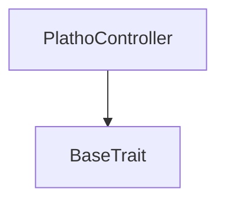

# Tact compilation report
Contract: PlathoController
BoC Size: 1416 bytes

## Structures (Structs and Messages)
Total structures: 17

### DataSize
TL-B: `_ cells:int257 bits:int257 refs:int257 = DataSize`
Signature: `DataSize{cells:int257,bits:int257,refs:int257}`

### SignedBundle
TL-B: `_ signature:fixed_bytes64 signedData:remainder<slice> = SignedBundle`
Signature: `SignedBundle{signature:fixed_bytes64,signedData:remainder<slice>}`

### StateInit
TL-B: `_ code:^cell data:^cell = StateInit`
Signature: `StateInit{code:^cell,data:^cell}`

### Context
TL-B: `_ bounceable:bool sender:address value:int257 raw:^slice = Context`
Signature: `Context{bounceable:bool,sender:address,value:int257,raw:^slice}`

### SendParameters
TL-B: `_ mode:int257 body:Maybe ^cell code:Maybe ^cell data:Maybe ^cell value:int257 to:address bounce:bool = SendParameters`
Signature: `SendParameters{mode:int257,body:Maybe ^cell,code:Maybe ^cell,data:Maybe ^cell,value:int257,to:address,bounce:bool}`

### MessageParameters
TL-B: `_ mode:int257 body:Maybe ^cell value:int257 to:address bounce:bool = MessageParameters`
Signature: `MessageParameters{mode:int257,body:Maybe ^cell,value:int257,to:address,bounce:bool}`

### DeployParameters
TL-B: `_ mode:int257 body:Maybe ^cell value:int257 bounce:bool init:StateInit{code:^cell,data:^cell} = DeployParameters`
Signature: `DeployParameters{mode:int257,body:Maybe ^cell,value:int257,bounce:bool,init:StateInit{code:^cell,data:^cell}}`

### StdAddress
TL-B: `_ workchain:int8 address:uint256 = StdAddress`
Signature: `StdAddress{workchain:int8,address:uint256}`

### VarAddress
TL-B: `_ workchain:int32 address:^slice = VarAddress`
Signature: `VarAddress{workchain:int32,address:^slice}`

### BasechainAddress
TL-B: `_ hash:Maybe int257 = BasechainAddress`
Signature: `BasechainAddress{hash:Maybe int257}`

### AnnounceSuccessorManifest
TL-B: `announce_successor_manifest#5355434d successor_manifest_hash:uint256 successor_vault:address = AnnounceSuccessorManifest`
Signature: `AnnounceSuccessorManifest{successor_manifest_hash:uint256,successor_vault:address}`

### ControllerProposeSuccessor
TL-B: `controller_propose_successor#c0de0001 nonce:uint64 target_vault:address successor_manifest_hash:uint256 successor_vault:address approvals:^cell = ControllerProposeSuccessor`
Signature: `ControllerProposeSuccessor{nonce:uint64,target_vault:address,successor_manifest_hash:uint256,successor_vault:address,approvals:^cell}`

### ControllerProposeRotate
TL-B: `controller_propose_rotate#c0de0002 nonce:uint64 slot:uint8 new_pubkey:uint256 approvals:^cell = ControllerProposeRotate`
Signature: `ControllerProposeRotate{nonce:uint64,slot:uint8,new_pubkey:uint256,approvals:^cell}`

### ControllerProposeCancel
TL-B: `controller_propose_cancel#c0de0003 nonce:uint64 approvals:^cell = ControllerProposeCancel`
Signature: `ControllerProposeCancel{nonce:uint64,approvals:^cell}`

### ControllerExecute
TL-B: `controller_execute#c0de0004  = ControllerExecute`
Signature: `ControllerExecute{}`

### ControllerStateView
TL-B: `_ threshold:int257 signer_count:int257 nonce:int257 timelock_seconds:int257 has_pending:bool pending_kind:int257 pending_effective_at:int257 pending_manifest_hash:int257 pending_target_vault:address pending_successor_vault:address pending_rotate_slot:int257 pending_rotate_pubkey:int257 = ControllerStateView`
Signature: `ControllerStateView{threshold:int257,signer_count:int257,nonce:int257,timelock_seconds:int257,has_pending:bool,pending_kind:int257,pending_effective_at:int257,pending_manifest_hash:int257,pending_target_vault:address,pending_successor_vault:address,pending_rotate_slot:int257,pending_rotate_pubkey:int257}`

### PlathoController$Data
TL-B: `_ signers:dict<int, int> nonce:uint64 has_pending:bool pending_kind:uint8 pending_effective_at:uint64 pending_manifest_hash:uint256 pending_target_vault:address pending_successor_vault:address pending_rotate_slot:uint8 pending_rotate_pubkey:uint256 = PlathoController`
Signature: `PlathoController{signers:dict<int, int>,nonce:uint64,has_pending:bool,pending_kind:uint8,pending_effective_at:uint64,pending_manifest_hash:uint256,pending_target_vault:address,pending_successor_vault:address,pending_rotate_slot:uint8,pending_rotate_pubkey:uint256}`

## Get methods
Total get methods: 2

## get_controller_state
No arguments

## get_signer
Argument: slot

## Exit codes
* 2: Stack underflow
* 3: Stack overflow
* 4: Integer overflow
* 5: Integer out of expected range
* 6: Invalid opcode
* 7: Type check error
* 8: Cell overflow
* 9: Cell underflow
* 10: Dictionary error
* 11: 'Unknown' error
* 12: Fatal error
* 13: Out of gas error
* 14: Virtualization error
* 32: Action list is invalid
* 33: Action list is too long
* 34: Action is invalid or not supported
* 35: Invalid source address in outbound message
* 36: Invalid destination address in outbound message
* 37: Not enough Toncoin
* 38: Not enough extra currencies
* 39: Outbound message does not fit into a cell after rewriting
* 40: Cannot process a message
* 41: Library reference is null
* 42: Library change action error
* 43: Exceeded maximum number of cells in the library or the maximum depth of the Merkle tree
* 50: Account state size exceeded limits
* 128: Null reference exception
* 129: Invalid serialization prefix
* 130: Invalid incoming message
* 131: Constraints error
* 132: Access denied
* 133: Contract stopped
* 134: Invalid argument
* 135: Code of a contract was not found
* 136: Invalid standard address
* 138: Not a basechain address

## Trait inheritance diagram

## Contract dependency diagram

