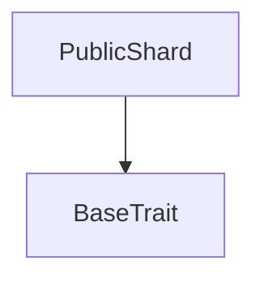

# Tact compilation report
Contract: PublicShard
BoC Size: 1675 bytes

## Structures (Structs and Messages)
Total structures: 18

### DataSize
TL-B: `_ cells:int257 bits:int257 refs:int257 = DataSize`
Signature: `DataSize{cells:int257,bits:int257,refs:int257}`

### SignedBundle
TL-B: `_ signature:fixed_bytes64 signedData:remainder<slice> = SignedBundle`
Signature: `SignedBundle{signature:fixed_bytes64,signedData:remainder<slice>}`

### StateInit
TL-B: `_ code:^cell data:^cell = StateInit`
Signature: `StateInit{code:^cell,data:^cell}`

### Context
TL-B: `_ bounceable:bool sender:address value:int257 raw:^slice = Context`
Signature: `Context{bounceable:bool,sender:address,value:int257,raw:^slice}`

### SendParameters
TL-B: `_ mode:int257 body:Maybe ^cell code:Maybe ^cell data:Maybe ^cell value:int257 to:address bounce:bool = SendParameters`
Signature: `SendParameters{mode:int257,body:Maybe ^cell,code:Maybe ^cell,data:Maybe ^cell,value:int257,to:address,bounce:bool}`

### MessageParameters
TL-B: `_ mode:int257 body:Maybe ^cell value:int257 to:address bounce:bool = MessageParameters`
Signature: `MessageParameters{mode:int257,body:Maybe ^cell,value:int257,to:address,bounce:bool}`

### DeployParameters
TL-B: `_ mode:int257 body:Maybe ^cell value:int257 bounce:bool init:StateInit{code:^cell,data:^cell} = DeployParameters`
Signature: `DeployParameters{mode:int257,body:Maybe ^cell,value:int257,bounce:bool,init:StateInit{code:^cell,data:^cell}}`

### StdAddress
TL-B: `_ workchain:int8 address:uint256 = StdAddress`
Signature: `StdAddress{workchain:int8,address:uint256}`

### VarAddress
TL-B: `_ workchain:int32 address:^slice = VarAddress`
Signature: `VarAddress{workchain:int32,address:^slice}`

### BasechainAddress
TL-B: `_ hash:Maybe int257 = BasechainAddress`
Signature: `BasechainAddress{hash:Maybe int257}`

### PublicPublish
TL-B: `public_publish#50535031 kind:uint8 key_arg:uint256 shard_seq:uint32 header:^cell body:^cell = PublicPublish`
Signature: `PublicPublish{kind:uint8,key_arg:uint256,shard_seq:uint32,header:^cell,body:^cell}`

### RetirePublicShard
TL-B: `retire_public_shard#50535033  = RetirePublicShard`
Signature: `RetirePublicShard{}`

### DepositCapsuleFee
TL-B: `deposit_capsule_fee#52535046 amount:uint128 lane:uint8 init_arg0:int257 init_arg1:int257 publisher:address = DepositCapsuleFee`
Signature: `DepositCapsuleFee{amount:uint128,lane:uint8,init_arg0:int257,init_arg1:int257,publisher:address}`

### PublicEntry
TL-B: `_ publisher:address body_commit:int257 created_at:int257 = PublicEntry`
Signature: `PublicEntry{publisher:address,body_commit:int257,created_at:int257}`

### PublicEntryView
TL-B: `_ exists:bool publisher:address body_commit:int257 created_at:int257 = PublicEntryView`
Signature: `PublicEntryView{exists:bool,publisher:address,body_commit:int257,created_at:int257}`

### PublicPage
TL-B: `_ from_id:int257 count:int257 entry_count:int257 rows:^cell = PublicPage`
Signature: `PublicPage{from_id:int257,count:int257,entry_count:int257,rows:^cell}`

### PublicShardView
TL-B: `_ partition_key:int257 epoch_tag:int257 kind:int257 era_index:int257 entry_count:int257 safe_cap:int257 era_seconds:int257 retention:int257 min_value:int257 deploy_min_value:int257 protocol_fee:int257 retire_at:int257 fee_sink:address = PublicShardView`
Signature: `PublicShardView{partition_key:int257,epoch_tag:int257,kind:int257,era_index:int257,entry_count:int257,safe_cap:int257,era_seconds:int257,retention:int257,min_value:int257,deploy_min_value:int257,protocol_fee:int257,retire_at:int257,fee_sink:address}`

### PublicShard$Data
TL-B: `_ partition_key:uint256 epoch_tag:uint64 entries:dict<int, ^PublicEntry{publisher:address,body_commit:int257,created_at:int257}> entry_count:uint32 = PublicShard`
Signature: `PublicShard{partition_key:uint256,epoch_tag:uint64,entries:dict<int, ^PublicEntry{publisher:address,body_commit:int257,created_at:int257}>,entry_count:uint32}`

## Get methods
Total get methods: 3

## get_page
Argument: from_id
Argument: max_count

## get_entry
Argument: entry_id

## get_view
No arguments

## Exit codes
* 2: Stack underflow
* 3: Stack overflow
* 4: Integer overflow
* 5: Integer out of expected range
* 6: Invalid opcode
* 7: Type check error
* 8: Cell overflow
* 9: Cell underflow
* 10: Dictionary error
* 11: 'Unknown' error
* 12: Fatal error
* 13: Out of gas error
* 14: Virtualization error
* 32: Action list is invalid
* 33: Action list is too long
* 34: Action is invalid or not supported
* 35: Invalid source address in outbound message
* 36: Invalid destination address in outbound message
* 37: Not enough Toncoin
* 38: Not enough extra currencies
* 39: Outbound message does not fit into a cell after rewriting
* 40: Cannot process a message
* 41: Library reference is null
* 42: Library change action error
* 43: Exceeded maximum number of cells in the library or the maximum depth of the Merkle tree
* 50: Account state size exceeded limits
* 128: Null reference exception
* 129: Invalid serialization prefix
* 130: Invalid incoming message
* 131: Constraints error
* 132: Access denied
* 133: Contract stopped
* 134: Invalid argument
* 135: Code of a contract was not found
* 136: Invalid standard address
* 138: Not a basechain address

## Trait inheritance diagram

## Contract dependency diagram

