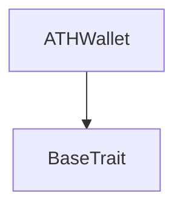
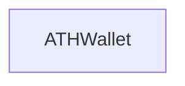

# Tact compilation report
Contract: ATHWallet
BoC Size: 2307 bytes

## Structures (Structs and Messages)
Total structures: 58

### DataSize
TL-B: `_ cells:int257 bits:int257 refs:int257 = DataSize`
Signature: `DataSize{cells:int257,bits:int257,refs:int257}`

### SignedBundle
TL-B: `_ signature:fixed_bytes64 signedData:remainder<slice> = SignedBundle`
Signature: `SignedBundle{signature:fixed_bytes64,signedData:remainder<slice>}`

### StateInit
TL-B: `_ code:^cell data:^cell = StateInit`
Signature: `StateInit{code:^cell,data:^cell}`

### Context
TL-B: `_ bounceable:bool sender:address value:int257 raw:^slice = Context`
Signature: `Context{bounceable:bool,sender:address,value:int257,raw:^slice}`

### SendParameters
TL-B: `_ mode:int257 body:Maybe ^cell code:Maybe ^cell data:Maybe ^cell value:int257 to:address bounce:bool = SendParameters`
Signature: `SendParameters{mode:int257,body:Maybe ^cell,code:Maybe ^cell,data:Maybe ^cell,value:int257,to:address,bounce:bool}`

### MessageParameters
TL-B: `_ mode:int257 body:Maybe ^cell value:int257 to:address bounce:bool = MessageParameters`
Signature: `MessageParameters{mode:int257,body:Maybe ^cell,value:int257,to:address,bounce:bool}`

### DeployParameters
TL-B: `_ mode:int257 body:Maybe ^cell value:int257 bounce:bool init:StateInit{code:^cell,data:^cell} = DeployParameters`
Signature: `DeployParameters{mode:int257,body:Maybe ^cell,value:int257,bounce:bool,init:StateInit{code:^cell,data:^cell}}`

### StdAddress
TL-B: `_ workchain:int8 address:uint256 = StdAddress`
Signature: `StdAddress{workchain:int8,address:uint256}`

### VarAddress
TL-B: `_ workchain:int32 address:^slice = VarAddress`
Signature: `VarAddress{workchain:int32,address:^slice}`

### BasechainAddress
TL-B: `_ hash:Maybe int257 = BasechainAddress`
Signature: `BasechainAddress{hash:Maybe int257}`

### ATHBurn
TL-B: `ath_burn#41544801 query_id:uint64 amount:uint128 response_destination:address = ATHBurn`
Signature: `ATHBurn{query_id:uint64,amount:uint128,response_destination:address}`

### ATHBurnNotification
TL-B: `ath_burn_notification#41544802 query_id:uint64 amount:uint128 owner_address:address response_destination:address = ATHBurnNotification`
Signature: `ATHBurnNotification{query_id:uint64,amount:uint128,owner_address:address,response_destination:address}`

### ATHBurnFinalized
TL-B: `ath_burn_finalized#41544803 query_id:uint64 amount:uint128 owner_address:address = ATHBurnFinalized`
Signature: `ATHBurnFinalized{query_id:uint64,amount:uint128,owner_address:address}`

### ATHBurnFailed
TL-B: `ath_burn_failed#41544804 query_id:uint64 amount:uint128 = ATHBurnFailed`
Signature: `ATHBurnFailed{query_id:uint64,amount:uint128}`

### ATHGenesisSupplyCredit
TL-B: `ath_genesis_supply_credit#41544805 query_id:uint64 amount:uint128 response_destination:address = ATHGenesisSupplyCredit`
Signature: `ATHGenesisSupplyCredit{query_id:uint64,amount:uint128,response_destination:address}`

### ATHGenesisSupplyAck
TL-B: `ath_genesis_supply_ack#41544806 query_id:uint64 amount:uint128 owner_address:address = ATHGenesisSupplyAck`
Signature: `ATHGenesisSupplyAck{query_id:uint64,amount:uint128,owner_address:address}`

### AthTransferNotification
TL-B: `ath_transfer_notification#472d9d7d query_id:uint64 amount:uint128 sender_wallet:address = AthTransferNotification`
Signature: `AthTransferNotification{query_id:uint64,amount:uint128,sender_wallet:address}`

### AthTransferNotificationAck
TL-B: `ath_transfer_notification_ack#472d9d7e query_id:uint64 amount:uint128 = AthTransferNotificationAck`
Signature: `AthTransferNotificationAck{query_id:uint64,amount:uint128}`

### ATHTransferRequest
TL-B: `ath_transfer_request#41544810 query_id:uint64 amount:uint128 recipient:address response_destination:address = ATHTransferRequest`
Signature: `ATHTransferRequest{query_id:uint64,amount:uint128,recipient:address,response_destination:address}`

### ATHTransferRequestWithNotify
TL-B: `ath_transfer_request_with_notify#41544814 query_id:uint64 amount:uint128 recipient:address response_destination:address notify_destination:address notify_value:uint128 = ATHTransferRequestWithNotify`
Signature: `ATHTransferRequestWithNotify{query_id:uint64,amount:uint128,recipient:address,response_destination:address,notify_destination:address,notify_value:uint128}`

### ATHInternalTransfer
TL-B: `ath_internal_transfer#41544812 query_id:uint64 amount:uint128 sender_owner:address response_destination:address = ATHInternalTransfer`
Signature: `ATHInternalTransfer{query_id:uint64,amount:uint128,sender_owner:address,response_destination:address}`

### ATHInternalTransferWithNotify
TL-B: `ath_internal_transfer_with_notify#41544815 query_id:uint64 amount:uint128 sender_owner:address response_destination:address notify_destination:address notify_value:uint128 = ATHInternalTransferWithNotify`
Signature: `ATHInternalTransferWithNotify{query_id:uint64,amount:uint128,sender_owner:address,response_destination:address,notify_destination:address,notify_value:uint128}`

### ATHTransferAck
TL-B: `ath_transfer_ack#41544811 query_id:uint64 amount:uint128 = ATHTransferAck`
Signature: `ATHTransferAck{query_id:uint64,amount:uint128}`

### ATHTransferFailed
TL-B: `ath_transfer_failed#41544813 query_id:uint64 amount:uint128 = ATHTransferFailed`
Signature: `ATHTransferFailed{query_id:uint64,amount:uint128}`

### ATHWalletDataView
TL-B: `_ balance:int257 owner_address:address ath_master_address:address = ATHWalletDataView`
Signature: `ATHWalletDataView{balance:int257,owner_address:address,ath_master_address:address}`

### PendingAthTransferNotification
TL-B: `_ sender_owner:address amount:uint128 = PendingAthTransferNotification`
Signature: `PendingAthTransferNotification{sender_owner:address,amount:uint128}`

### ATHWallet$Data
TL-B: `_ balance:uint128 owner_address:address ath_master_address:address pending_notifications:dict<int, ^PendingAthTransferNotification{sender_owner:address,amount:uint128}> processed_notifications:dict<int, int> = ATHWallet`
Signature: `ATHWallet{balance:uint128,owner_address:address,ath_master_address:address,pending_notifications:dict<int, ^PendingAthTransferNotification{sender_owner:address,amount:uint128}>,processed_notifications:dict<int, int>}`

### BindDeploymentManifest
TL-B: `bind_deployment_manifest#90e2e0cb deployment_manifest_hash:uint256 counterpart_address:address = BindDeploymentManifest`
Signature: `BindDeploymentManifest{deployment_manifest_hash:uint256,counterpart_address:address}`

### BindOfficialAthWallet
TL-B: `bind_official_ath_wallet#18db2ccb deployment_manifest_hash:uint256 official_ath_wallet_address:address = BindOfficialAthWallet`
Signature: `BindOfficialAthWallet{deployment_manifest_hash:uint256,official_ath_wallet_address:address}`

### SealGenesis
TL-B: `seal_genesis#3a12d1ad deployment_manifest_hash:uint256 = SealGenesis`
Signature: `SealGenesis{deployment_manifest_hash:uint256}`

### DepositTon
TL-B: `deposit_ton#2aafbd98 amount:uint128 = DepositTon`
Signature: `DepositTon{amount:uint128}`

### WithdrawTon
TL-B: `withdraw_ton#484c1d72 amount:uint128 recipient:address = WithdrawTon`
Signature: `WithdrawTon{amount:uint128,recipient:address}`

### WithdrawAth
TL-B: `withdraw_ath#f9a44834 query_id:uint64 amount:uint128 recipient:address = WithdrawAth`
Signature: `WithdrawAth{query_id:uint64,amount:uint128,recipient:address}`

### TopUpMessageBudget
TL-B: `top_up_message_budget#86a15f92 amount:uint128 = TopUpMessageBudget`
Signature: `TopUpMessageBudget{amount:uint128}`

### SetSession
TL-B: `set_session#ff3fbcc0 session_pubkey:uint256 expires_at:uint32 = SetSession`
Signature: `SetSession{session_pubkey:uint256,expires_at:uint32}`

### RevokeSession
TL-B: `revoke_session#db1ccdbe  = RevokeSession`
Signature: `RevokeSession{}`

### RegisterMessagingKeys
TL-B: `register_messaging_keys#52705eda enc_pubkey:uint256 sign_pubkey:uint256 pq_kem_pubkey_hash:uint256 pq_kem_pubkey_len:uint16 crypto_suite_mask:uint16 = RegisterMessagingKeys`
Signature: `RegisterMessagingKeys{enc_pubkey:uint256,sign_pubkey:uint256,pq_kem_pubkey_hash:uint256,pq_kem_pubkey_len:uint16,crypto_suite_mask:uint16}`

### ReplaceMessagingKeys
TL-B: `replace_messaging_keys#89d648bb enc_pubkey:uint256 sign_pubkey:uint256 pq_kem_pubkey_hash:uint256 pq_kem_pubkey_len:uint16 crypto_suite_mask:uint16 = ReplaceMessagingKeys`
Signature: `ReplaceMessagingKeys{enc_pubkey:uint256,sign_pubkey:uint256,pq_kem_pubkey_hash:uint256,pq_kem_pubkey_len:uint16,crypto_suite_mask:uint16}`

### CreateReceiveIntent
TL-B: `create_receive_intent#f780f913 asset:uint8 amount:uint128 recipient_wallet:address commitment:uint256 expires_at:uint32 client_nonce:uint64 = CreateReceiveIntent`
Signature: `CreateReceiveIntent{asset:uint8,amount:uint128,recipient_wallet:address,commitment:uint256,expires_at:uint32,client_nonce:uint64}`

### ClaimReceiveIntent
TL-B: `claim_receive_intent#99ecccfc intent_id:uint256 secret32:uint256 = ClaimReceiveIntent`
Signature: `ClaimReceiveIntent{intent_id:uint256,secret32:uint256}`

### CancelReceiveIntent
TL-B: `cancel_receive_intent#32289374 intent_id:uint256 = CancelReceiveIntent`
Signature: `CancelReceiveIntent{intent_id:uint256}`

### PublishPrivateFromVault
TL-B: `publish_private_from_vault#a4f862c0 bounce_id:uint64 publish_id:uint256 size_class:uint8 crypto_suite:uint8 header_0_hash:uint256 header_1_hash:uint256 body_hash:uint256 protocol_fee_paid:uint128 = PublishPrivateFromVault`
Signature: `PublishPrivateFromVault{bounce_id:uint64,publish_id:uint256,size_class:uint8,crypto_suite:uint8,header_0_hash:uint256,header_1_hash:uint256,body_hash:uint256,protocol_fee_paid:uint128}`

### PublishPublicFromVault
TL-B: `publish_public_from_vault#8c2a76b7 bounce_id:uint64 publish_id:uint256 author_wallet:address body_hash:uint256 protocol_fee_paid:uint128 = PublishPublicFromVault`
Signature: `PublishPublicFromVault{bounce_id:uint64,publish_id:uint256,author_wallet:address,body_hash:uint256,protocol_fee_paid:uint128}`

### CapsuleHubPublishAck
TL-B: `capsule_hub_publish_ack#874e576a publish_id:uint256 entry_id:uint64 entry_uid:uint256 = CapsuleHubPublishAck`
Signature: `CapsuleHubPublishAck{publish_id:uint256,entry_id:uint64,entry_uid:uint256}`

### PrunePendingPublish
TL-B: `prune_pending_publish#720bdd6d publish_id:uint256 = PrunePendingPublish`
Signature: `PrunePendingPublish{publish_id:uint256}`

### PendingAthWithdrawal
TL-B: `_ owner_wallet:address recipient:address recipient_ath_wallet:address amount:uint128 created_at:uint32 = PendingAthWithdrawal`
Signature: `PendingAthWithdrawal{owner_wallet:address,recipient:address,recipient_ath_wallet:address,amount:uint128,created_at:uint32}`

### PendingPublish
TL-B: `_ owner_wallet:address session_id:uint256 budget_epoch:uint64 nonce:uint64 publish_kind:uint8 body_hash:uint256 protocol_fee_paid:uint128 capsulehub_call_value:uint128 refundable_budget_amount:uint128 created_at:uint32 = PendingPublish`
Signature: `PendingPublish{owner_wallet:address,session_id:uint256,budget_epoch:uint64,nonce:uint64,publish_kind:uint8,body_hash:uint256,protocol_fee_paid:uint128,capsulehub_call_value:uint128,refundable_budget_amount:uint128,created_at:uint32}`

### ReceiveIntent
TL-B: `_ sender_wallet:address recipient_wallet:address asset:uint8 amount:uint128 commitment:uint256 expires_at:uint32 client_nonce:uint64 created_at:uint32 claimed:bool = ReceiveIntent`
Signature: `ReceiveIntent{sender_wallet:address,recipient_wallet:address,asset:uint8,amount:uint128,commitment:uint256,expires_at:uint32,client_nonce:uint64,created_at:uint32,claimed:bool}`

### KeyRecord
TL-B: `_ owner_wallet:address key_generation:uint32 enc_pubkey:uint256 sign_pubkey:uint256 pq_kem_pubkey_hash:uint256 pq_kem_pubkey_len:uint16 crypto_suite_mask:uint16 created_at:uint32 created_lt:uint64 revoked_at:uint32 revoked_lt:uint64 = KeyRecord`
Signature: `KeyRecord{owner_wallet:address,key_generation:uint32,enc_pubkey:uint256,sign_pubkey:uint256,pq_kem_pubkey_hash:uint256,pq_kem_pubkey_len:uint16,crypto_suite_mask:uint16,created_at:uint32,created_lt:uint64,revoked_at:uint32,revoked_lt:uint64}`

### UserState
TL-B: `_ ton_balance:uint128 ath_balance:uint128 message_budget_ton:uint128 budget_epoch:uint64 current_key_id:uint256 = UserState`
Signature: `UserState{ton_balance:uint128,ath_balance:uint128,message_budget_ton:uint128,budget_epoch:uint64,current_key_id:uint256}`

### SessionState
TL-B: `_ session_pubkey:uint256 session_id:uint256 nonce:uint64 expires_at:uint32 active:bool = SessionState`
Signature: `SessionState{session_pubkey:uint256,session_id:uint256,nonce:uint64,expires_at:uint32,active:bool}`

### VaultReceiveIntentView
TL-B: `_ exists:bool sender_wallet:address recipient_wallet:address asset:int257 amount:int257 commitment:int257 expires_at:int257 client_nonce:int257 created_at:int257 claimed:bool = VaultReceiveIntentView`
Signature: `VaultReceiveIntentView{exists:bool,sender_wallet:address,recipient_wallet:address,asset:int257,amount:int257,commitment:int257,expires_at:int257,client_nonce:int257,created_at:int257,claimed:bool}`

### VaultKeyRecordView
TL-B: `_ exists:bool owner_wallet:address key_generation:int257 enc_pubkey:int257 sign_pubkey:int257 pq_kem_pubkey_hash:int257 pq_kem_pubkey_len:int257 crypto_suite_mask:int257 created_at:int257 created_lt:int257 revoked_at:int257 revoked_lt:int257 = VaultKeyRecordView`
Signature: `VaultKeyRecordView{exists:bool,owner_wallet:address,key_generation:int257,enc_pubkey:int257,sign_pubkey:int257,pq_kem_pubkey_hash:int257,pq_kem_pubkey_len:int257,crypto_suite_mask:int257,created_at:int257,created_lt:int257,revoked_at:int257,revoked_lt:int257}`

### VaultUserView
TL-B: `_ exists:bool ton_balance:int257 ath_balance:int257 message_budget_ton:int257 budget_epoch:int257 current_key_id:int257 = VaultUserView`
Signature: `VaultUserView{exists:bool,ton_balance:int257,ath_balance:int257,message_budget_ton:int257,budget_epoch:int257,current_key_id:int257}`

### VaultSessionView
TL-B: `_ exists:bool session_pubkey:int257 session_id:int257 nonce:int257 expires_at:int257 active:bool = VaultSessionView`
Signature: `VaultSessionView{exists:bool,session_pubkey:int257,session_id:int257,nonce:int257,expires_at:int257,active:bool}`

### VaultPendingAthWithdrawalView
TL-B: `_ exists:bool owner_wallet:address recipient:address recipient_ath_wallet:address amount:int257 created_at:int257 = VaultPendingAthWithdrawalView`
Signature: `VaultPendingAthWithdrawalView{exists:bool,owner_wallet:address,recipient:address,recipient_ath_wallet:address,amount:int257,created_at:int257}`

### VaultGlobalView
TL-B: `_ sealed:bool capsule_hub_bound:bool deployment_manifest_hash:int257 capsule_hub_address:address vault_ath_wallet_address:address ath_master_address:address user_count:int257 session_count:int257 key_record_count:int257 receive_intent_count:int257 pending_ath_withdrawal_count:int257 pending_publish_count:int257 processed_ath_deposit_count:int257 pending_publish_stale_ttl:int257 airdrop_remaining_ath:int257 airdrop_distributed_ath:int257 airdrop_reward_per_message_ath:int257 airdrop_total_allocation_ath:int257 = VaultGlobalView`
Signature: `VaultGlobalView{sealed:bool,capsule_hub_bound:bool,deployment_manifest_hash:int257,capsule_hub_address:address,vault_ath_wallet_address:address,ath_master_address:address,user_count:int257,session_count:int257,key_record_count:int257,receive_intent_count:int257,pending_ath_withdrawal_count:int257,pending_publish_count:int257,processed_ath_deposit_count:int257,pending_publish_stale_ttl:int257,airdrop_remaining_ath:int257,airdrop_distributed_ath:int257,airdrop_reward_per_message_ath:int257,airdrop_total_allocation_ath:int257}`

### Vault$Data
TL-B: `_ vault_ath_wallet_address:address ath_master_address:address capsule_hub_address:address capsule_hub_bound:bool sealed:bool deployment_manifest_hash:uint256 genesis_config_hash:uint256 users:dict<address, ^UserState{ton_balance:uint128,ath_balance:uint128,message_budget_ton:uint128,budget_epoch:uint64,current_key_id:uint256}> sessions:dict<address, ^SessionState{session_pubkey:uint256,session_id:uint256,nonce:uint64,expires_at:uint32,active:bool}> key_records:dict<int, ^KeyRecord{owner_wallet:address,key_generation:uint32,enc_pubkey:uint256,sign_pubkey:uint256,pq_kem_pubkey_hash:uint256,pq_kem_pubkey_len:uint16,crypto_suite_mask:uint16,created_at:uint32,created_lt:uint64,revoked_at:uint32,revoked_lt:uint64}> receive_intents:dict<int, ^ReceiveIntent{sender_wallet:address,recipient_wallet:address,asset:uint8,amount:uint128,commitment:uint256,expires_at:uint32,client_nonce:uint64,created_at:uint32,claimed:bool}> processed_ath_deposits:dict<int, int> pending_ath_withdrawals:dict<int, ^PendingAthWithdrawal{owner_wallet:address,recipient:address,recipient_ath_wallet:address,amount:uint128,created_at:uint32}> pending_publishes:dict<int, ^PendingPublish{owner_wallet:address,session_id:uint256,budget_epoch:uint64,nonce:uint64,publish_kind:uint8,body_hash:uint256,protocol_fee_paid:uint128,capsulehub_call_value:uint128,refundable_budget_amount:uint128,created_at:uint32}> user_count:uint64 session_count:uint64 key_record_count:uint64 receive_intent_count:uint64 processed_ath_deposit_count:uint64 pending_ath_withdrawal_count:uint64 pending_publish_count:uint64 = Vault`
Signature: `Vault{vault_ath_wallet_address:address,ath_master_address:address,capsule_hub_address:address,capsule_hub_bound:bool,sealed:bool,deployment_manifest_hash:uint256,genesis_config_hash:uint256,users:dict<address, ^UserState{ton_balance:uint128,ath_balance:uint128,message_budget_ton:uint128,budget_epoch:uint64,current_key_id:uint256}>,sessions:dict<address, ^SessionState{session_pubkey:uint256,session_id:uint256,nonce:uint64,expires_at:uint32,active:bool}>,key_records:dict<int, ^KeyRecord{owner_wallet:address,key_generation:uint32,enc_pubkey:uint256,sign_pubkey:uint256,pq_kem_pubkey_hash:uint256,pq_kem_pubkey_len:uint16,crypto_suite_mask:uint16,created_at:uint32,created_lt:uint64,revoked_at:uint32,revoked_lt:uint64}>,receive_intents:dict<int, ^ReceiveIntent{sender_wallet:address,recipient_wallet:address,asset:uint8,amount:uint128,commitment:uint256,expires_at:uint32,client_nonce:uint64,created_at:uint32,claimed:bool}>,processed_ath_deposits:dict<int, int>,pending_ath_withdrawals:dict<int, ^PendingAthWithdrawal{owner_wallet:address,recipient:address,recipient_ath_wallet:address,amount:uint128,created_at:uint32}>,pending_publishes:dict<int, ^PendingPublish{owner_wallet:address,session_id:uint256,budget_epoch:uint64,nonce:uint64,publish_kind:uint8,body_hash:uint256,protocol_fee_paid:uint128,capsulehub_call_value:uint128,refundable_budget_amount:uint128,created_at:uint32}>,user_count:uint64,session_count:uint64,key_record_count:uint64,receive_intent_count:uint64,processed_ath_deposit_count:uint64,pending_ath_withdrawal_count:uint64,pending_publish_count:uint64}`

## Get methods
Total get methods: 1

## get_wallet_data
No arguments

## Exit codes
* 2: Stack underflow
* 3: Stack overflow
* 4: Integer overflow
* 5: Integer out of expected range
* 6: Invalid opcode
* 7: Type check error
* 8: Cell overflow
* 9: Cell underflow
* 10: Dictionary error
* 11: 'Unknown' error
* 12: Fatal error
* 13: Out of gas error
* 14: Virtualization error
* 32: Action list is invalid
* 33: Action list is too long
* 34: Action is invalid or not supported
* 35: Invalid source address in outbound message
* 36: Invalid destination address in outbound message
* 37: Not enough Toncoin
* 38: Not enough extra currencies
* 39: Outbound message does not fit into a cell after rewriting
* 40: Cannot process a message
* 41: Library reference is null
* 42: Library change action error
* 43: Exceeded maximum number of cells in the library or the maximum depth of the Merkle tree
* 50: Account state size exceeded limits
* 128: Null reference exception
* 129: Invalid serialization prefix
* 130: Invalid incoming message
* 131: Constraints error
* 132: Access denied
* 133: Contract stopped
* 134: Invalid argument
* 135: Code of a contract was not found
* 136: Invalid standard address
* 138: Not a basechain address

## Trait inheritance diagram

## Contract dependency diagram

