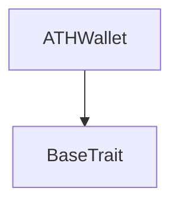
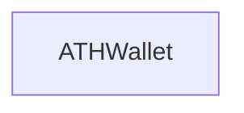

# Tact compilation report
Contract: ATHWallet
BoC Size: 6622 bytes

## Structures (Structs and Messages)
Total structures: 80

### DataSize
TL-B: `_ cells:int257 bits:int257 refs:int257 = DataSize`
Signature: `DataSize{cells:int257,bits:int257,refs:int257}`

### SignedBundle
TL-B: `_ signature:fixed_bytes64 signedData:remainder<slice> = SignedBundle`
Signature: `SignedBundle{signature:fixed_bytes64,signedData:remainder<slice>}`

### StateInit
TL-B: `_ code:^cell data:^cell = StateInit`
Signature: `StateInit{code:^cell,data:^cell}`

### Context
TL-B: `_ bounceable:bool sender:address value:int257 raw:^slice = Context`
Signature: `Context{bounceable:bool,sender:address,value:int257,raw:^slice}`

### SendParameters
TL-B: `_ mode:int257 body:Maybe ^cell code:Maybe ^cell data:Maybe ^cell value:int257 to:address bounce:bool = SendParameters`
Signature: `SendParameters{mode:int257,body:Maybe ^cell,code:Maybe ^cell,data:Maybe ^cell,value:int257,to:address,bounce:bool}`

### MessageParameters
TL-B: `_ mode:int257 body:Maybe ^cell value:int257 to:address bounce:bool = MessageParameters`
Signature: `MessageParameters{mode:int257,body:Maybe ^cell,value:int257,to:address,bounce:bool}`

### DeployParameters
TL-B: `_ mode:int257 body:Maybe ^cell value:int257 bounce:bool init:StateInit{code:^cell,data:^cell} = DeployParameters`
Signature: `DeployParameters{mode:int257,body:Maybe ^cell,value:int257,bounce:bool,init:StateInit{code:^cell,data:^cell}}`

### StdAddress
TL-B: `_ workchain:int8 address:uint256 = StdAddress`
Signature: `StdAddress{workchain:int8,address:uint256}`

### VarAddress
TL-B: `_ workchain:int32 address:^slice = VarAddress`
Signature: `VarAddress{workchain:int32,address:^slice}`

### BasechainAddress
TL-B: `_ hash:Maybe int257 = BasechainAddress`
Signature: `BasechainAddress{hash:Maybe int257}`

### ATHBurn
TL-B: `ath_burn#41544801 query_id:uint64 amount:uint128 response_destination:address = ATHBurn`
Signature: `ATHBurn{query_id:uint64,amount:uint128,response_destination:address}`

### ATHBurnNotification
TL-B: `ath_burn_notification#41544802 query_id:uint64 amount:uint128 owner_address:address response_destination:address = ATHBurnNotification`
Signature: `ATHBurnNotification{query_id:uint64,amount:uint128,owner_address:address,response_destination:address}`

### ATHBurnFinalized
TL-B: `ath_burn_finalized#41544803 query_id:uint64 amount:uint128 owner_address:address = ATHBurnFinalized`
Signature: `ATHBurnFinalized{query_id:uint64,amount:uint128,owner_address:address}`

### ATHBurnFailed
TL-B: `ath_burn_failed#41544804 query_id:uint64 amount:uint128 = ATHBurnFailed`
Signature: `ATHBurnFailed{query_id:uint64,amount:uint128}`

### ATHGenesisSupplyCredit
TL-B: `ath_genesis_supply_credit#41544805 query_id:uint64 amount:uint128 response_destination:address = ATHGenesisSupplyCredit`
Signature: `ATHGenesisSupplyCredit{query_id:uint64,amount:uint128,response_destination:address}`

### ATHGenesisSupplyAck
TL-B: `ath_genesis_supply_ack#41544806 query_id:uint64 amount:uint128 owner_address:address = ATHGenesisSupplyAck`
Signature: `ATHGenesisSupplyAck{query_id:uint64,amount:uint128,owner_address:address}`

### AthTransferNotification
TL-B: `ath_transfer_notification#472d9d7d query_id:uint64 sender_key:uint160 amount:uint128 sender_wallet:address = AthTransferNotification`
Signature: `AthTransferNotification{query_id:uint64,sender_key:uint160,amount:uint128,sender_wallet:address}`

### AthTransferNotificationAck
TL-B: `ath_transfer_notification_ack#472d9d7e query_id:uint64 amount:uint128 sender_key:uint160 = AthTransferNotificationAck`
Signature: `AthTransferNotificationAck{query_id:uint64,amount:uint128,sender_key:uint160}`

### AthTransferNotificationRefund
TL-B: `ath_transfer_notification_refund#4154481e query_id:uint64 amount:uint128 sender_key:uint160 = AthTransferNotificationRefund`
Signature: `AthTransferNotificationRefund{query_id:uint64,amount:uint128,sender_key:uint160}`

### PruneStaleNotification
TL-B: `prune_stale_notification#504e5052 query_id:uint64 sender_key:uint160 = PruneStaleNotification`
Signature: `PruneStaleNotification{query_id:uint64,sender_key:uint160}`

### AthTransferNotificationVaultMintUsername
TL-B: `ath_transfer_notification_vault_mint_username#89129d60 query_id:uint64 sender_key:uint160 amount:uint128 payer_wallet:address owner_wallet:address username_len:uint8 username:remainder<slice> = AthTransferNotificationVaultMintUsername`
Signature: `AthTransferNotificationVaultMintUsername{query_id:uint64,sender_key:uint160,amount:uint128,payer_wallet:address,owner_wallet:address,username_len:uint8,username:remainder<slice>}`

### AthTransferNotificationVaultProfileAvatar
TL-B: `ath_transfer_notification_vault_profile_avatar#a11a7002 query_id:uint64 sender_key:uint160 amount:uint128 payer_wallet:address owner_wallet:address avatar_hash:uint256 avatar_entry_id:uint64 avatar_stream_id:uint128 avatar_part_count:uint16 media_format:uint8 = AthTransferNotificationVaultProfileAvatar`
Signature: `AthTransferNotificationVaultProfileAvatar{query_id:uint64,sender_key:uint160,amount:uint128,payer_wallet:address,owner_wallet:address,avatar_hash:uint256,avatar_entry_id:uint64,avatar_stream_id:uint128,avatar_part_count:uint16,media_format:uint8}`

### ATHTransferRequest
TL-B: `ath_transfer_request#41544810 query_id:uint64 amount:uint128 recipient:address response_destination:address = ATHTransferRequest`
Signature: `ATHTransferRequest{query_id:uint64,amount:uint128,recipient:address,response_destination:address}`

### ATHTransferRequestWithNotify
TL-B: `ath_transfer_request_with_notify#41544814 query_id:uint64 amount:uint128 recipient:address response_destination:address notify_destination:address notify_value:uint128 = ATHTransferRequestWithNotify`
Signature: `ATHTransferRequestWithNotify{query_id:uint64,amount:uint128,recipient:address,response_destination:address,notify_destination:address,notify_value:uint128}`

### ATHTransferRequestVaultProfileAvatar
TL-B: `ath_transfer_request_vault_profile_avatar#4154481a query_id:uint64 amount:uint128 recipient:address response_destination:address notify_value:uint128 owner_wallet:address avatar_hash:uint256 avatar_entry_id:uint64 avatar_stream_id:uint128 avatar_part_count:uint16 media_format:uint8 = ATHTransferRequestVaultProfileAvatar`
Signature: `ATHTransferRequestVaultProfileAvatar{query_id:uint64,amount:uint128,recipient:address,response_destination:address,notify_value:uint128,owner_wallet:address,avatar_hash:uint256,avatar_entry_id:uint64,avatar_stream_id:uint128,avatar_part_count:uint16,media_format:uint8}`

### ATHTransferRequestVaultMintUsername
TL-B: `ath_transfer_request_vault_mint_username#4154481c query_id:uint64 amount:uint128 recipient:address response_destination:address notify_value:uint128 owner_wallet:address username_len:uint8 username:remainder<slice> = ATHTransferRequestVaultMintUsername`
Signature: `ATHTransferRequestVaultMintUsername{query_id:uint64,amount:uint128,recipient:address,response_destination:address,notify_value:uint128,owner_wallet:address,username_len:uint8,username:remainder<slice>}`

### ATHInternalTransfer
TL-B: `ath_internal_transfer#41544812 query_id:uint64 amount:uint128 sender_owner:address response_destination:address = ATHInternalTransfer`
Signature: `ATHInternalTransfer{query_id:uint64,amount:uint128,sender_owner:address,response_destination:address}`

### ATHInternalTransferWithNotify
TL-B: `ath_internal_transfer_with_notify#41544815 query_id:uint64 amount:uint128 sender_owner:address response_destination:address notify_destination:address notify_value:uint128 = ATHInternalTransferWithNotify`
Signature: `ATHInternalTransferWithNotify{query_id:uint64,amount:uint128,sender_owner:address,response_destination:address,notify_destination:address,notify_value:uint128}`

### ATHInternalTransferVaultProfileAvatar
TL-B: `ath_internal_transfer_vault_profile_avatar#4154481b query_id:uint64 amount:uint128 sender_owner:address response_destination:address notify_value:uint128 owner_wallet:address avatar_hash:uint256 avatar_entry_id:uint64 avatar_stream_id:uint128 avatar_part_count:uint16 media_format:uint8 = ATHInternalTransferVaultProfileAvatar`
Signature: `ATHInternalTransferVaultProfileAvatar{query_id:uint64,amount:uint128,sender_owner:address,response_destination:address,notify_value:uint128,owner_wallet:address,avatar_hash:uint256,avatar_entry_id:uint64,avatar_stream_id:uint128,avatar_part_count:uint16,media_format:uint8}`

### ATHInternalTransferVaultMintUsername
TL-B: `ath_internal_transfer_vault_mint_username#4154481d query_id:uint64 amount:uint128 sender_owner:address response_destination:address notify_value:uint128 owner_wallet:address username_len:uint8 username:remainder<slice> = ATHInternalTransferVaultMintUsername`
Signature: `ATHInternalTransferVaultMintUsername{query_id:uint64,amount:uint128,sender_owner:address,response_destination:address,notify_value:uint128,owner_wallet:address,username_len:uint8,username:remainder<slice>}`

### ATHTransferAck
TL-B: `ath_transfer_ack#41544811 query_id:uint64 amount:uint128 = ATHTransferAck`
Signature: `ATHTransferAck{query_id:uint64,amount:uint128}`

### ATHTransferFailed
TL-B: `ath_transfer_failed#41544813 query_id:uint64 amount:uint128 = ATHTransferFailed`
Signature: `ATHTransferFailed{query_id:uint64,amount:uint128}`

### JettonTransfer
TL-B: `jetton_transfer#0f8a7ea5 query_id:uint64 amount:coins destination:address response_destination:address custom_payload:Maybe ^cell forward_ton_amount:coins forward_payload:remainder<slice> = JettonTransfer`
Signature: `JettonTransfer{query_id:uint64,amount:coins,destination:address,response_destination:address,custom_payload:Maybe ^cell,forward_ton_amount:coins,forward_payload:remainder<slice>}`

### JettonInternalTransfer
TL-B: `jetton_internal_transfer#178d4519 query_id:uint64 amount:coins from:address response_address:address forward_ton_amount:coins forward_payload:remainder<slice> = JettonInternalTransfer`
Signature: `JettonInternalTransfer{query_id:uint64,amount:coins,from:address,response_address:address,forward_ton_amount:coins,forward_payload:remainder<slice>}`

### JettonTransferNotification
TL-B: `jetton_transfer_notification#7362d09c query_id:uint64 amount:coins sender:address forward_payload:remainder<slice> = JettonTransferNotification`
Signature: `JettonTransferNotification{query_id:uint64,amount:coins,sender:address,forward_payload:remainder<slice>}`

### JettonExcesses
TL-B: `jetton_excesses#d53276db query_id:uint64 = JettonExcesses`
Signature: `JettonExcesses{query_id:uint64}`

### ATHWalletDataView
TL-B: `_ balance:int257 owner_address:address ath_master_address:address jetton_wallet_code:^cell = ATHWalletDataView`
Signature: `ATHWalletDataView{balance:int257,owner_address:address,ath_master_address:address,jetton_wallet_code:^cell}`

### PendingAthTransferNotificationView
TL-B: `_ exists:bool sender_owner:address response_destination:address amount:int257 created_at:int257 = PendingAthTransferNotificationView`
Signature: `PendingAthTransferNotificationView{exists:bool,sender_owner:address,response_destination:address,amount:int257,created_at:int257}`

### PendingAthTransferNotification
TL-B: `_ sender_owner:address response_destination:address response_ack_value:uint64 amount:uint128 created_at:uint64 = PendingAthTransferNotification`
Signature: `PendingAthTransferNotification{sender_owner:address,response_destination:address,response_ack_value:uint64,amount:uint128,created_at:uint64}`

### PendingAthOutgoingTransfer
TL-B: `_ recipient_wallet:address response_destination:address amount:uint128 created_at:uint64 = PendingAthOutgoingTransfer`
Signature: `PendingAthOutgoingTransfer{recipient_wallet:address,response_destination:address,amount:uint128,created_at:uint64}`

### ATHWallet$Data
TL-B: `_ balance:uint128 owner_address:address ath_master_address:address pending_notifications:dict<int, ^PendingAthTransferNotification{sender_owner:address,response_destination:address,response_ack_value:uint64,amount:uint128,created_at:uint64}> processed_notifications:dict<int, int> pending_outgoing_transfers:dict<int, ^PendingAthOutgoingTransfer{recipient_wallet:address,response_destination:address,amount:uint128,created_at:uint64}> = ATHWallet`
Signature: `ATHWallet{balance:uint128,owner_address:address,ath_master_address:address,pending_notifications:dict<int, ^PendingAthTransferNotification{sender_owner:address,response_destination:address,response_ack_value:uint64,amount:uint128,created_at:uint64}>,processed_notifications:dict<int, int>,pending_outgoing_transfers:dict<int, ^PendingAthOutgoingTransfer{recipient_wallet:address,response_destination:address,amount:uint128,created_at:uint64}>}`

### BindDeploymentManifest
TL-B: `bind_deployment_manifest#90e2e0cb deployment_manifest_hash:uint256 counterpart_address:address = BindDeploymentManifest`
Signature: `BindDeploymentManifest{deployment_manifest_hash:uint256,counterpart_address:address}`

### BindOfficialAthWallet
TL-B: `bind_official_ath_wallet#18db2ccb deployment_manifest_hash:uint256 official_ath_wallet_address:address = BindOfficialAthWallet`
Signature: `BindOfficialAthWallet{deployment_manifest_hash:uint256,official_ath_wallet_address:address}`

### BindProfileRegistry
TL-B: `bind_profile_registry#50a61103 deployment_manifest_hash:uint256 profile_registry_address:address = BindProfileRegistry`
Signature: `BindProfileRegistry{deployment_manifest_hash:uint256,profile_registry_address:address}`

### BindUsernameRegistry
TL-B: `bind_username_registry#50a61104 deployment_manifest_hash:uint256 username_registry_address:address = BindUsernameRegistry`
Signature: `BindUsernameRegistry{deployment_manifest_hash:uint256,username_registry_address:address}`

### SealGenesis
TL-B: `seal_genesis#3a12d1ad deployment_manifest_hash:uint256 = SealGenesis`
Signature: `SealGenesis{deployment_manifest_hash:uint256}`

### DepositTon
TL-B: `deposit_ton#2aafbd98 amount:uint128 = DepositTon`
Signature: `DepositTon{amount:uint128}`

### RegisterMessagingKeys
TL-B: `register_messaging_keys#52705eda enc_pubkey:uint256 sign_pubkey:uint256 auth_pubkey:uint256 pq_kem_pubkey_hash:uint256 pq_kem_pubkey_len:uint16 pq_kem_pubkey:^cell crypto_suite_mask:uint16 = RegisterMessagingKeys`
Signature: `RegisterMessagingKeys{enc_pubkey:uint256,sign_pubkey:uint256,auth_pubkey:uint256,pq_kem_pubkey_hash:uint256,pq_kem_pubkey_len:uint16,pq_kem_pubkey:^cell,crypto_suite_mask:uint16}`

### ReplaceMessagingKeys
TL-B: `replace_messaging_keys#89d648bb owner_wallet:address signature:fixed_bytes64 signed_payload:^cell envelope_padding:remainder<slice> = ReplaceMessagingKeys`
Signature: `ReplaceMessagingKeys{owner_wallet:address,signature:fixed_bytes64,signed_payload:^cell,envelope_padding:remainder<slice>}`

### CreateReceiveIntent
TL-B: `create_receive_intent#7e1f5035 owner_wallet:address signature:fixed_bytes64 signed_payload:^cell envelope_padding:remainder<slice> = CreateReceiveIntent`
Signature: `CreateReceiveIntent{owner_wallet:address,signature:fixed_bytes64,signed_payload:^cell,envelope_padding:remainder<slice>}`

### ClaimReceiveIntent
TL-B: `claim_receive_intent#7e1f5036 owner_wallet:address signature:fixed_bytes64 signed_payload:^cell envelope_padding:remainder<slice> = ClaimReceiveIntent`
Signature: `ClaimReceiveIntent{owner_wallet:address,signature:fixed_bytes64,signed_payload:^cell,envelope_padding:remainder<slice>}`

### CancelReceiveIntent
TL-B: `cancel_receive_intent#7e1f5037 owner_wallet:address signature:fixed_bytes64 signed_payload:^cell envelope_padding:remainder<slice> = CancelReceiveIntent`
Signature: `CancelReceiveIntent{owner_wallet:address,signature:fixed_bytes64,signed_payload:^cell,envelope_padding:remainder<slice>}`

### WithdrawTonFromVaultBalance
TL-B: `withdraw_ton_from_vault_balance#7e1f5038 owner_wallet:address signature:fixed_bytes64 signed_payload:^cell envelope_padding:remainder<slice> = WithdrawTonFromVaultBalance`
Signature: `WithdrawTonFromVaultBalance{owner_wallet:address,signature:fixed_bytes64,signed_payload:^cell,envelope_padding:remainder<slice>}`

### WithdrawAthFromVaultBalance
TL-B: `withdraw_ath_from_vault_balance#7e1f5039 owner_wallet:address signature:fixed_bytes64 signed_payload:^cell envelope_padding:remainder<slice> = WithdrawAthFromVaultBalance`
Signature: `WithdrawAthFromVaultBalance{owner_wallet:address,signature:fixed_bytes64,signed_payload:^cell,envelope_padding:remainder<slice>}`

### SetProfileAvatarFromVaultBalance
TL-B: `set_profile_avatar_from_vault_balance#7e1f5033 owner_wallet:address signature:fixed_bytes64 signed_payload:^cell envelope_padding:remainder<slice> = SetProfileAvatarFromVaultBalance`
Signature: `SetProfileAvatarFromVaultBalance{owner_wallet:address,signature:fixed_bytes64,signed_payload:^cell,envelope_padding:remainder<slice>}`

### MintUsernameFromVaultBalance
TL-B: `mint_username_from_vault_balance#7e1f5034 owner_wallet:address signature:fixed_bytes64 signed_payload:^cell envelope_padding:remainder<slice> = MintUsernameFromVaultBalance`
Signature: `MintUsernameFromVaultBalance{owner_wallet:address,signature:fixed_bytes64,signed_payload:^cell,envelope_padding:remainder<slice>}`

### PublishBatchFromVaultBalance
TL-B: `publish_batch_from_vault_balance#7e1f5041 owner_wallet:address signature:fixed_bytes64 signed_payload:^cell envelope_padding:remainder<slice> = PublishBatchFromVaultBalance`
Signature: `PublishBatchFromVaultBalance{owner_wallet:address,signature:fixed_bytes64,signed_payload:^cell,envelope_padding:remainder<slice>}`

### PublishBatchToHub
TL-B: `publish_batch_to_hub#a4f862d1 bounce_id:uint64 bounce_tag:uint160 publish_id:uint256 publish_kind:uint8 part_count:uint8 protocol_fee_total:uint128 author_wallet:address parts:^cell marketing:Maybe ^cell = PublishBatchToHub`
Signature: `PublishBatchToHub{bounce_id:uint64,bounce_tag:uint160,publish_id:uint256,publish_kind:uint8,part_count:uint8,protocol_fee_total:uint128,author_wallet:address,parts:^cell,marketing:Maybe ^cell}`

### CapsuleHubBatchAck
TL-B: `capsule_hub_batch_ack#874e5771 publish_id:uint256 first_entry_id:uint64 part_count:uint8 batch_uid:uint256 = CapsuleHubBatchAck`
Signature: `CapsuleHubBatchAck{publish_id:uint256,first_entry_id:uint64,part_count:uint8,batch_uid:uint256}`

### PruneBatchPublish
TL-B: `prune_batch_publish#720bdd6e publish_id:uint256 = PruneBatchPublish`
Signature: `PruneBatchPublish{publish_id:uint256}`

### AnnounceSuccessorManifest
TL-B: `announce_successor_manifest#5355434d successor_manifest_hash:uint256 successor_vault:address = AnnounceSuccessorManifest`
Signature: `AnnounceSuccessorManifest{successor_manifest_hash:uint256,successor_vault:address}`

### TopUpStorageReserve
TL-B: `top_up_storage_reserve#3215b5fd  = TopUpStorageReserve`
Signature: `TopUpStorageReserve{}`

### ProfileAvatarTonExcessRefund
TL-B: `profile_avatar_ton_excess_refund#50a61121 query_id:uint64 owner_wallet:address amount:uint128 = ProfileAvatarTonExcessRefund`
Signature: `ProfileAvatarTonExcessRefund{query_id:uint64,owner_wallet:address,amount:uint128}`

### PendingAthWithdrawal
TL-B: `_ owner_wallet:address recipient:address recipient_ath_wallet:address amount:uint128 refundable_ton_amount:uint128 created_at:uint64 = PendingAthWithdrawal`
Signature: `PendingAthWithdrawal{owner_wallet:address,recipient:address,recipient_ath_wallet:address,amount:uint128,refundable_ton_amount:uint128,created_at:uint64}`

### PendingBatchPublish
TL-B: `_ owner_wallet:address tombstone:bool refund_to_vault:bool nonce:uint64 publish_kind:uint8 part_count:uint8 publish_id:uint256 refundable_amount:uint128 created_at:uint64 = PendingBatchPublish`
Signature: `PendingBatchPublish{owner_wallet:address,tombstone:bool,refund_to_vault:bool,nonce:uint64,publish_kind:uint8,part_count:uint8,publish_id:uint256,refundable_amount:uint128,created_at:uint64}`

### PendingProfileAvatarPayment
TL-B: `_ owner_wallet:address amount:uint128 created_at:uint64 = PendingProfileAvatarPayment`
Signature: `PendingProfileAvatarPayment{owner_wallet:address,amount:uint128,created_at:uint64}`

### PendingUsernameMintPayment
TL-B: `_ owner_wallet:address amount:uint128 created_at:uint64 = PendingUsernameMintPayment`
Signature: `PendingUsernameMintPayment{owner_wallet:address,amount:uint128,created_at:uint64}`

### ReceiveIntent
TL-B: `_ sender_wallet:address recipient_wallet:address asset:uint8 amount:uint128 commitment:uint256 client_nonce:uint64 settlement_reserve_ton:uint128 created_at:uint64 claimed:bool = ReceiveIntent`
Signature: `ReceiveIntent{sender_wallet:address,recipient_wallet:address,asset:uint8,amount:uint128,commitment:uint256,client_nonce:uint64,settlement_reserve_ton:uint128,created_at:uint64,claimed:bool}`

### KeyRecord
TL-B: `_ owner_wallet:address key_generation:uint32 enc_pubkey:uint256 sign_pubkey:uint256 pq_kem_pubkey_hash:uint256 pq_kem_pubkey_len:uint16 pq_kem_pubkey:^cell crypto_suite_mask:uint16 created_at:uint64 created_lt:uint64 revoked_at:uint64 revoked_lt:uint64 = KeyRecord`
Signature: `KeyRecord{owner_wallet:address,key_generation:uint32,enc_pubkey:uint256,sign_pubkey:uint256,pq_kem_pubkey_hash:uint256,pq_kem_pubkey_len:uint16,pq_kem_pubkey:^cell,crypto_suite_mask:uint16,created_at:uint64,created_lt:uint64,revoked_at:uint64,revoked_lt:uint64}`

### ReceiptSlot
TL-B: `_ nonce:uint64 action:uint8 result:uint8 aux:uint64 part_count:uint8 at:uint64 = ReceiptSlot`
Signature: `ReceiptSlot{nonce:uint64,action:uint8,result:uint8,aux:uint64,part_count:uint8,at:uint64}`

### UserState
TL-B: `_ ton_balance:uint128 ath_balance:uint128 current_key_id:uint256 auth_pubkey:uint256 publish_nonce:uint64 receipts:dict<uint8, ^ReceiptSlot{nonce:uint64,action:uint8,result:uint8,aux:uint64,part_count:uint8,at:uint64}> = UserState`
Signature: `UserState{ton_balance:uint128,ath_balance:uint128,current_key_id:uint256,auth_pubkey:uint256,publish_nonce:uint64,receipts:dict<uint8, ^ReceiptSlot{nonce:uint64,action:uint8,result:uint8,aux:uint64,part_count:uint8,at:uint64}>}`

### VaultReceiveIntentView
TL-B: `_ exists:bool sender_wallet:address recipient_wallet:address asset:int257 amount:int257 commitment:int257 client_nonce:int257 settlement_reserve_ton:int257 created_at:int257 claimed:bool = VaultReceiveIntentView`
Signature: `VaultReceiveIntentView{exists:bool,sender_wallet:address,recipient_wallet:address,asset:int257,amount:int257,commitment:int257,client_nonce:int257,settlement_reserve_ton:int257,created_at:int257,claimed:bool}`

### VaultKeyRecordView
TL-B: `_ exists:bool owner_wallet:address key_generation:int257 enc_pubkey:int257 sign_pubkey:int257 pq_kem_pubkey_hash:int257 pq_kem_pubkey_len:int257 pq_kem_pubkey:^cell crypto_suite_mask:int257 created_at:int257 created_lt:int257 revoked_at:int257 revoked_lt:int257 = VaultKeyRecordView`
Signature: `VaultKeyRecordView{exists:bool,owner_wallet:address,key_generation:int257,enc_pubkey:int257,sign_pubkey:int257,pq_kem_pubkey_hash:int257,pq_kem_pubkey_len:int257,pq_kem_pubkey:^cell,crypto_suite_mask:int257,created_at:int257,created_lt:int257,revoked_at:int257,revoked_lt:int257}`

### VaultUserView
TL-B: `_ exists:bool ton_balance:int257 ath_balance:int257 current_key_id:int257 auth_pubkey:int257 publish_nonce:int257 = VaultUserView`
Signature: `VaultUserView{exists:bool,ton_balance:int257,ath_balance:int257,current_key_id:int257,auth_pubkey:int257,publish_nonce:int257}`

### VaultUserReceiptsView
TL-B: `_ exists:bool publish_nonce:int257 receipts:dict<uint8, ^ReceiptSlot{nonce:uint64,action:uint8,result:uint8,aux:uint64,part_count:uint8,at:uint64}> = VaultUserReceiptsView`
Signature: `VaultUserReceiptsView{exists:bool,publish_nonce:int257,receipts:dict<uint8, ^ReceiptSlot{nonce:uint64,action:uint8,result:uint8,aux:uint64,part_count:uint8,at:uint64}>}`

### VaultPendingAthWithdrawalView
TL-B: `_ exists:bool owner_wallet:address recipient:address recipient_ath_wallet:address amount:int257 created_at:int257 = VaultPendingAthWithdrawalView`
Signature: `VaultPendingAthWithdrawalView{exists:bool,owner_wallet:address,recipient:address,recipient_ath_wallet:address,amount:int257,created_at:int257}`

### VaultSuccessorView
TL-B: `_ announced:bool successor_manifest_hash:int257 successor_vault:address announced_at:int257 = VaultSuccessorView`
Signature: `VaultSuccessorView{announced:bool,successor_manifest_hash:int257,successor_vault:address,announced_at:int257}`

### VaultPendingBatchPublishView
TL-B: `_ exists:bool owner_wallet:address nonce:int257 publish_kind:int257 part_count:int257 created_at:int257 tombstone:bool = VaultPendingBatchPublishView`
Signature: `VaultPendingBatchPublishView{exists:bool,owner_wallet:address,nonce:int257,publish_kind:int257,part_count:int257,created_at:int257,tombstone:bool}`

### VaultGlobalView
TL-B: `_ sealed:bool capsule_hub_bound:bool profile_registry_bound:bool username_registry_bound:bool deployment_manifest_hash:int257 capsule_hub_address:address profile_registry_address:address username_registry_address:address vault_ath_wallet_address:address ath_master_address:address user_count:int257 key_record_count:int257 receive_intent_count:int257 pending_ath_withdrawal_count:int257 pending_publish_count:int257 pending_profile_avatar_payment_count:int257 pending_username_mint_payment_count:int257 processed_ath_deposit_count:int257 pending_publish_stale_ttl:int257 airdrop_remaining_ath:int257 airdrop_distributed_ath:int257 airdrop_reward_per_message_ath:int257 airdrop_total_allocation_ath:int257 = VaultGlobalView`
Signature: `VaultGlobalView{sealed:bool,capsule_hub_bound:bool,profile_registry_bound:bool,username_registry_bound:bool,deployment_manifest_hash:int257,capsule_hub_address:address,profile_registry_address:address,username_registry_address:address,vault_ath_wallet_address:address,ath_master_address:address,user_count:int257,key_record_count:int257,receive_intent_count:int257,pending_ath_withdrawal_count:int257,pending_publish_count:int257,pending_profile_avatar_payment_count:int257,pending_username_mint_payment_count:int257,processed_ath_deposit_count:int257,pending_publish_stale_ttl:int257,airdrop_remaining_ath:int257,airdrop_distributed_ath:int257,airdrop_reward_per_message_ath:int257,airdrop_total_allocation_ath:int257}`

### Vault$Data
TL-B: `_ vault_ath_wallet_address:address ath_master_address:address capsule_hub_address:address profile_registry_address:address username_registry_address:address binding_flags:uint8 sealed:bool deployment_manifest_hash:uint256 genesis_config_hash:uint256 users:dict<address, ^UserState{ton_balance:uint128,ath_balance:uint128,current_key_id:uint256,auth_pubkey:uint256,publish_nonce:uint64,receipts:dict<uint8, ^ReceiptSlot{nonce:uint64,action:uint8,result:uint8,aux:uint64,part_count:uint8,at:uint64}>}> key_records:dict<int, ^KeyRecord{owner_wallet:address,key_generation:uint32,enc_pubkey:uint256,sign_pubkey:uint256,pq_kem_pubkey_hash:uint256,pq_kem_pubkey_len:uint16,pq_kem_pubkey:^cell,crypto_suite_mask:uint16,created_at:uint64,created_lt:uint64,revoked_at:uint64,revoked_lt:uint64}> receive_intents:dict<uint128, ^ReceiveIntent{sender_wallet:address,recipient_wallet:address,asset:uint8,amount:uint128,commitment:uint256,client_nonce:uint64,settlement_reserve_ton:uint128,created_at:uint64,claimed:bool}> processed_ath_deposits:dict<int, int> pending_ath_withdrawals:dict<int, ^PendingAthWithdrawal{owner_wallet:address,recipient:address,recipient_ath_wallet:address,amount:uint128,refundable_ton_amount:uint128,created_at:uint64}> pending_batch_publishes:dict<int, ^PendingBatchPublish{owner_wallet:address,tombstone:bool,refund_to_vault:bool,nonce:uint64,publish_kind:uint8,part_count:uint8,publish_id:uint256,refundable_amount:uint128,created_at:uint64}> pending_profile_avatar_payments:dict<int, ^PendingProfileAvatarPayment{owner_wallet:address,amount:uint128,created_at:uint64}> pending_username_mint_payments:dict<int, ^PendingUsernameMintPayment{owner_wallet:address,amount:uint128,created_at:uint64}> user_count:uint64 key_record_count:uint64 receive_intent_count:uint64 processed_ath_deposit_count:uint64 pending_ath_withdrawal_count:uint64 pending_publish_count:uint64 genesis_ext:^cell = Vault`
Signature: `Vault{vault_ath_wallet_address:address,ath_master_address:address,capsule_hub_address:address,profile_registry_address:address,username_registry_address:address,binding_flags:uint8,sealed:bool,deployment_manifest_hash:uint256,genesis_config_hash:uint256,users:dict<address, ^UserState{ton_balance:uint128,ath_balance:uint128,current_key_id:uint256,auth_pubkey:uint256,publish_nonce:uint64,receipts:dict<uint8, ^ReceiptSlot{nonce:uint64,action:uint8,result:uint8,aux:uint64,part_count:uint8,at:uint64}>}>,key_records:dict<int, ^KeyRecord{owner_wallet:address,key_generation:uint32,enc_pubkey:uint256,sign_pubkey:uint256,pq_kem_pubkey_hash:uint256,pq_kem_pubkey_len:uint16,pq_kem_pubkey:^cell,crypto_suite_mask:uint16,created_at:uint64,created_lt:uint64,revoked_at:uint64,revoked_lt:uint64}>,receive_intents:dict<uint128, ^ReceiveIntent{sender_wallet:address,recipient_wallet:address,asset:uint8,amount:uint128,commitment:uint256,client_nonce:uint64,settlement_reserve_ton:uint128,created_at:uint64,claimed:bool}>,processed_ath_deposits:dict<int, int>,pending_ath_withdrawals:dict<int, ^PendingAthWithdrawal{owner_wallet:address,recipient:address,recipient_ath_wallet:address,amount:uint128,refundable_ton_amount:uint128,created_at:uint64}>,pending_batch_publishes:dict<int, ^PendingBatchPublish{owner_wallet:address,tombstone:bool,refund_to_vault:bool,nonce:uint64,publish_kind:uint8,part_count:uint8,publish_id:uint256,refundable_amount:uint128,created_at:uint64}>,pending_profile_avatar_payments:dict<int, ^PendingProfileAvatarPayment{owner_wallet:address,amount:uint128,created_at:uint64}>,pending_username_mint_payments:dict<int, ^PendingUsernameMintPayment{owner_wallet:address,amount:uint128,created_at:uint64}>,user_count:uint64,key_record_count:uint64,receive_intent_count:uint64,processed_ath_deposit_count:uint64,pending_ath_withdrawal_count:uint64,pending_publish_count:uint64,genesis_ext:^cell}`

## Get methods
Total get methods: 2

## get_wallet_data
No arguments

## get_pending_notification
Argument: query_id
Argument: sender_key

## Exit codes
* 2: Stack underflow
* 3: Stack overflow
* 4: Integer overflow
* 5: Integer out of expected range
* 6: Invalid opcode
* 7: Type check error
* 8: Cell overflow
* 9: Cell underflow
* 10: Dictionary error
* 11: 'Unknown' error
* 12: Fatal error
* 13: Out of gas error
* 14: Virtualization error
* 32: Action list is invalid
* 33: Action list is too long
* 34: Action is invalid or not supported
* 35: Invalid source address in outbound message
* 36: Invalid destination address in outbound message
* 37: Not enough Toncoin
* 38: Not enough extra currencies
* 39: Outbound message does not fit into a cell after rewriting
* 40: Cannot process a message
* 41: Library reference is null
* 42: Library change action error
* 43: Exceeded maximum number of cells in the library or the maximum depth of the Merkle tree
* 50: Account state size exceeded limits
* 128: Null reference exception
* 129: Invalid serialization prefix
* 130: Invalid incoming message
* 131: Constraints error
* 132: Access denied
* 133: Contract stopped
* 134: Invalid argument
* 135: Code of a contract was not found
* 136: Invalid standard address
* 138: Not a basechain address

## Trait inheritance diagram

## Contract dependency diagram

